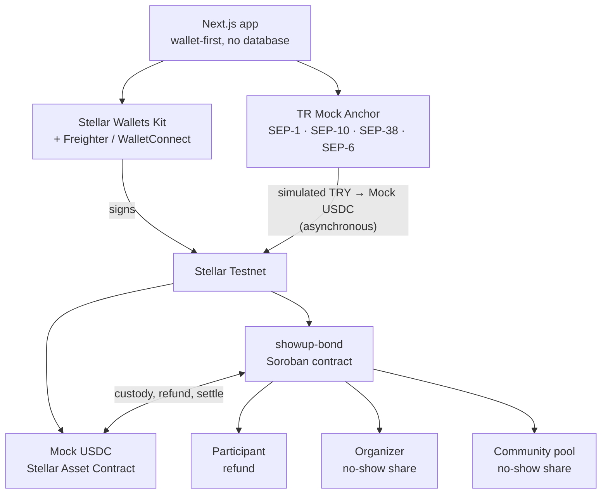
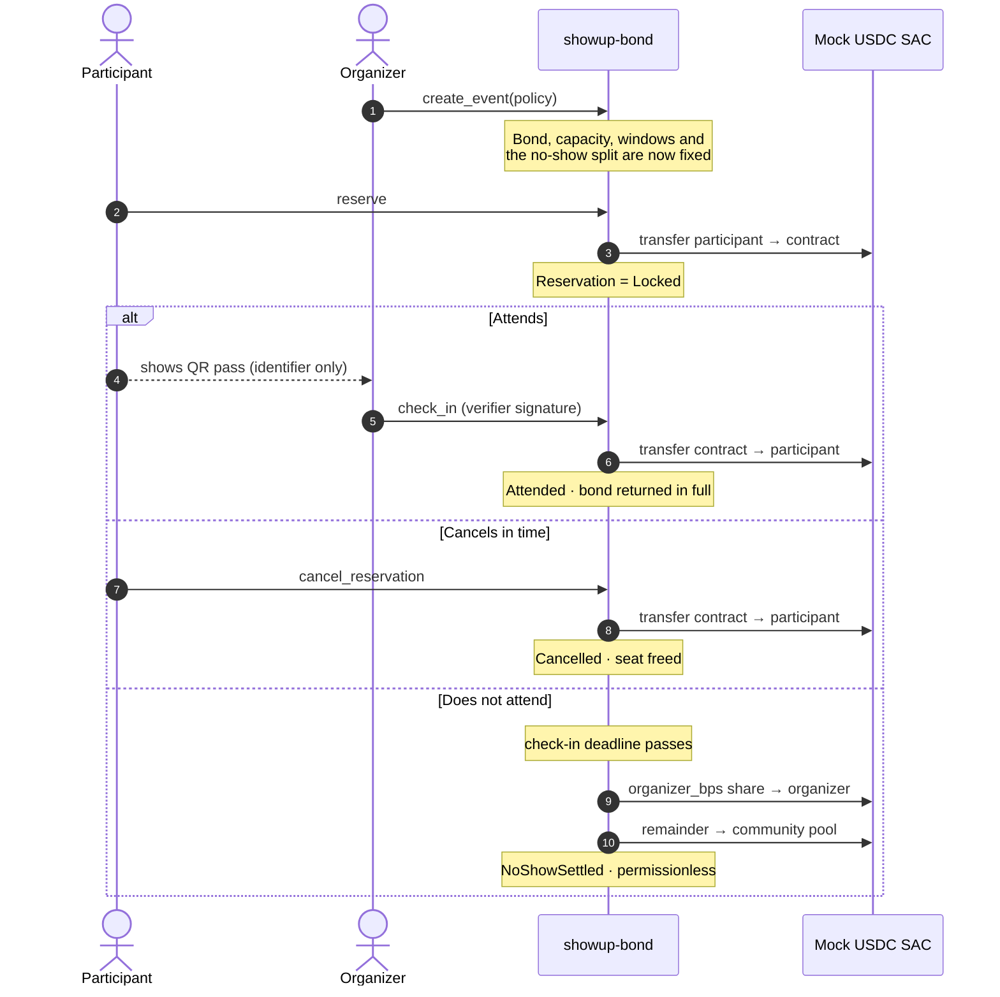

# ShowUp

**Programmable attendance commitment bonds for events and reservations, on Stellar.**

Rise In × Stellar Pro Hackathon Türkiye 2026 — **Genesis** track — **Stellar Testnet**.

**Live demo: [showup-steel.vercel.app](https://showup-steel.vercel.app)** ·
**Contract: [`CCCDFM2M…IRHM`](https://stellar.expert/explorer/testnet/contract/CCCDFM2MGKO5PEBS565O7FO2OL4CZYUFFRTQLUPPIIIL2JNCPUSUIRHM)**

> The P0 product is deployed and the bond lifecycle is verified on-chain — see
> **Submission evidence** for the reserve, check-in refund and 80/20 no-show
> settlement transactions. Browser-signed equivalents and a completed Mock
> Anchor on-ramp are still being captured; this README never presents a pending
> item as complete.

### Try it in two minutes

1. Open the demo and install [Freighter](https://www.freighter.app/), set to **Testnet**.
2. `/wallet` → fund the account with friendbot, then **Enable USDC**.
3. `/events` → open an event, read the full policy, and **Reserve**.
4. `/reservations/[id]` → your QR pass. The organizer scans it at
   `/organizer/events/[id]/scan` and signs the check-in; the contract returns
   the bond in the same transaction.

Mock USDC normally arrives through the Anchor on `/wallet`. While that service's
on-ramp worker is degraded, the [Circle testnet faucet](https://faucet.circle.com)
issues the same asset.

## Why

Free and limited-capacity events lose seats when registration carries no
commitment. ShowUp uses a small refundable bond:

1. A participant sees the exact Mock USDC bond and a public TRY estimate.
2. They can add Testnet funds through the TR Mock Anchor.
3. A Soroban contract locks the bond; the organizer never holds it in advance.
4. Check in or cancel on time and the contract returns the full bond.
5. After a no-show, the contract applies the event's published split exactly.

The Anchor funding transaction and the Soroban bond transaction are separate,
asynchronous operations. The UI never presents them as one atomic payment.

### Who this is for

The first users are **organizers of free, limited-capacity events** — meetups,
workshops, community classes, university club sessions — where registration is
free, seats are scarce, and no-show rates routinely run 30–50%. For them a lost
seat is wasted catering, wasted room booking, and a waitlist that never got
called.

The second users are **the participants who do show up**, who today compete for
seats against people who registered with nothing at stake.

Istanbul's meetup and workshop scene is the concrete beachhead: high event
density, an existing TRY payment habit, and a local Anchor path that makes the
bond denominated in a currency attendees actually think in.

The same primitive extends, unchanged, to restaurant reservations, clinic
appointments, sports courts and coworking desks. ShowUp is not a ticketing
platform — it is the commitment-and-settlement layer such a platform would need.

## Claim boundary

| True in this project | Not claimed |
|---|---|
| Turkey Mock Anchor on Stellar Testnet | Real Turkish-lira processing |
| Simulated bank transfer and mock KYC | Production banking or KYC/AML |
| Circle-issued Testnet USDC | Mainnet or production USDC settlement |
| Atomic effects inside one Soroban call | Atomicity between a bank, Anchor and contract |
| Wallet-signed Testnet transactions | Custody of user keys or funds |

No real money moves, no real KYC is performed, and Mainnet is out of scope.

## Architecture



The two inbound paths are deliberately separate. Anchor funding and the Soroban
bond call are different transactions at different times, and nothing in the
product joins them into one step.

### The bond lifecycle



The application is wallet-first and has no application database or server-held
signing key. Contract getters and events are the data source. The technical
details panel exposes only allowlisted public Testnet identifiers; it never
renders SEP-10 tokens or environment objects.

### Load-bearing Stellar integrations

- **Soroban:** owns custody, deadlines, authorization and settlement policy.
- **Stellar Asset Contract:** the pinned settlement token is
  `CBIELTK6YBZJU5UP2WWQEUCYKLPU6AUNZ2BQ4WWFEIE3USCIHMXQDAMA`.
- **Classic asset:** `USDC` issued by
  `GBBD47IF6LWK7P7MDEVSCWR7DPUWV3NY3DTQEVFL4NAT4AQH3ZLLFLA5` on Testnet.
- **Stellar Wallets Kit + Freighter:** uses the browser extension on desktop
  and WalletConnect v2 to hand mobile sessions to the Freighter app; every
  write remains user-signed.
- **RPC and Horizon:** read contract state, ledgers, balances, reserves and trustlines.
- **TR Mock Anchor:** provides the simulated TRY → Testnet USDC path through
  SEP-1/10/38/6. Its `simulate-bank-transfer` endpoint is sandbox-only.

## Contract guarantees

| Method | Authorization | Effect |
|---|---|---|
| `create_event` | organizer | Publishes immutable bond policy and schedule |
| `reserve` | participant | Transfers the exact event bond into contract custody |
| `cancel_reservation` | participant | Returns the bond before the deadline |
| `check_in` | stored verifier | Returns the bond inside the check-in window |
| `cancel_event` | organizer | Cancels without an unbounded refund loop |
| `claim_cancelled_event_refund` | permissionless | Pulls one participant's full refund |
| `settle_no_show` | permissionless | Pays the exact organizer/community split |

Every money-moving path first requires a `Locked` reservation. A reservation
then enters one terminal state, preventing double refunds and double settlement.
The community leg receives the integer remainder, so no rounding dust is lost.

## Repository

```text
apps/web/                    Next.js 16 application
contracts/showup-bond/       Soroban contract and Rust tests
packages/showup-bond-client/ generated TypeScript bindings
scripts/                     preflight, identities, deploy and demo fixtures
docs/                        architecture, evidence, security and demo runbook
```

## Setup

Requirements: Node.js ≥22.12, pnpm ≥10, stable Rust with `wasm32v1-none`, and
Stellar CLI 28.x.

```bash
pnpm install
pnpm preflight
cp .env.example apps/web/.env.local
pnpm dev
```

The defaults are Testnet-only. Set `NEXT_PUBLIC_ENABLE_DEMO_TOOLS=true` only for
the clearly labelled hackathon sandbox flow; keep it `false` in any environment
that is not demonstrating the Mock Anchor.

Mobile wallet handoff also requires a public Reown project identifier in
`NEXT_PUBLIC_WALLETCONNECT_PROJECT_ID`. Create it at
[cloud.reown.com](https://cloud.reown.com), allow the deployed origin, and add
the same value to the Vercel environment. It is a public client identifier, not
a wallet secret.

### Verification

```bash
pnpm verify          # Linux/macOS with a native contract toolchain
pnpm win:verify      # Windows; routes Rust/Soroban commands through WSL
pnpm smoke:stellar   # live Testnet + Anchor discovery smoke check
```

The latest complete local run passes the Next.js production build, ESLint,
TypeScript, all web tests, Rust formatting, clippy, 58 contract tests and the
optimized Wasm build.

### Contract deployment and demo fixtures

Run from the environment that owns the Stellar CLI identities (WSL on this
Windows workstation):

```bash
./scripts/setup-identities.sh --fund
./scripts/deploy-testnet.sh --dry-run
./scripts/deploy-testnet.sh
./scripts/seed-demo-event.sh --fast
```

The scripts refuse non-Testnet passphrases. Secrets remain in the Stellar CLI
keystore and never enter `.env` or the repository.

### Frontend deployment

Import the repository into Vercel as a pnpm monorepo, select `apps/web` as the
application, retain workspace access to `packages/showup-bond-client`, and copy
only the public values from `.env.example`. Before publishing, run
`pnpm win:verify` (or `pnpm verify`) and keep demo tools disabled unless the
deployment is explicitly the labelled Testnet hackathon demo. A public URL has
not yet been recorded.

## Stellar Skills used

The exact files used during development are:

- `skills/standards/SKILL.md`
- `skills/smart-contracts/SKILL.md`
- `skills/assets/SKILL.md`
- `skills/dapp/SKILL.md`
- `skills/data/SKILL.md`

See [docs/stellar-skills.md](docs/stellar-skills.md) for the decisions each file
influenced and the live corrections discovered during implementation.

## Technical decisions and what they cost

**No database.** Financial truth is on-chain by requirement, so the only
question was where the *non*-financial data lives. Event title and venue are
bounded strings in contract storage; discovery enumerates `get_event_count()`
and reads events back. That removed a hosted Postgres, a service-role key, RLS
policies and a second system that can be down during a demo. The cost is a few
extra simulate calls per page load, and organizer reservation lists that depend
on the RPC event window — measured live at ~7 days, which the app reports
honestly when it cannot see far enough back.

**The settlement token is pinned at deploy, not per event.** `create_event`
takes no token address. An organizer therefore cannot point an event at a
worthless token, and cannot name themselves as the community pool. Two attack
classes disappear for the price of one constructor argument.

**Pull-based refunds on event cancellation.** `cancel_event` writes one status
field and returns. Iterating participants would make the organizer's ability to
cancel depend on attendance, could exceed the transaction resource budget, and
would strand people on a partial failure. Each participant claims their own
refund in a fixed-cost, independently retryable transaction.

**The QR carries no authority.** It is `{v, eventId, participant, issuedAt}` —
no signature, no nonce, no server round trip. A short-lived nonce was evaluated
and rejected: the only attack it targets is a participant relaying their pass to
someone present, and any relay window long enough to be usable is long enough to
defeat it. Replay, double check-in and window violations are all rejected by the
contract instead, and only the verifier's wallet can move money.

**Every deadline is judged by the ledger clock.** `env.ledger().timestamp()` in
the contract, `getLedgerNow()` in the UI. Eligibility predicates take the clock
as an explicit parameter so that reaching for `Date.now()` is a type error
rather than a review comment.

### Problems that cost real time

- **Soroban does not build on this Windows host.** `soroban-sdk-macros` is a
  proc-macro crate, so even a `wasm32v1-none` build needs a host C toolchain and
  there is no MSVC linker here. All contract work routes through WSL via the
  `win:*` scripts. Git Bash makes it worse: coreutils `link` shadows MSVC
  `link.exe` and the error misdirects.
- **Stellar Wallets Kit defaults to Mainnet.** Its internal `selectedNetwork` is
  `Networks.PUBLIC`, and every sign call resolves
  `opts?.networkPassphrase || selectedNetwork`. Miss both and a Testnet-only app
  asks the user to sign for Mainnet. The adapter sets the network at `init()`,
  passes the passphrase on every call, and asserts Testnet before signing.
- **The generated bindings pin an older SDK.** `stellar contract bindings
  typescript` writes `^16.0.1` while the app runs 17.1.0; under pnpm that is a
  second SDK copy and every `instanceof` across the boundary silently fails. The
  deploy script rewrites the pin as part of generation.
- **The hackathon's own integration guide is wrong in six places.** Most
  consequentially, `pending_trust` is not the no-trustline path — the Anchor
  issues a claimable balance and the deposit still completes. The corrections are
  catalogued in [docs/architecture/SYSTEM.md](docs/architecture/SYSTEM.md).

## What comes next

The hackathon build stops at the P0 primitive on purpose. The credible next
steps, in order:

1. **Mainnet-readiness review** — a security pass over the settlement paths and
   TTL policy, then a real USDC deployment behind a feature flag.
2. **Organizer self-service** — event editing before the first bond is locked,
   multiple verifiers per event, and a waitlist that promotes automatically when
   someone cancels.
3. **Verticals** — the same contract already fits restaurant covers, clinic
   appointments and court bookings. Each needs its own onboarding, not new
   settlement logic.
4. **Funding path** — the intended next step is the **Stellar Community Fund**,
   with this repository and the Testnet evidence below as the technical basis.

## Known limitations

- A participant who cancels cannot reserve the same event again in P0; the
  terminal reservation record is intentionally never overwritten.
- Contract instance TTL is refreshed when an event is created. Persistent bond
  records extend their own TTL and remain restorable; long-idle deployments
  still need maintenance.
- Reservation discovery depends on retained contract events and explicitly
  reports when history may be incomplete.
- QR data is an identifier, not authorization. Current contract state and the
  verifier's wallet signature remain authoritative; QR age is only a warning.
- Mock Anchor availability and its on-ramp worker are external dependencies.
  `/health` being green does not by itself prove a deposit worker completed a
  payment. The app keeps polling, reports degraded states and never fabricates
  success.
- USDC → TRY withdrawal is P1 and does not gate the P0 demo.

## Submission evidence

| Item | Evidence |
|---|---|
| Testnet contract | [CCCDFM2MGKO5PEBS565O7FO2OL4CZYUFFRTQLUPPIIIL2JNCPUSUIRHM](https://stellar.expert/explorer/testnet/contract/CCCDFM2MGKO5PEBS565O7FO2OL4CZYUFFRTQLUPPIIIL2JNCPUSUIRHM) |
| Wasm upload | [651dd075474426439024f83ddb6024e2e3bfc14d46bfeafecefc390c2c6d8703](https://stellar.expert/explorer/testnet/tx/651dd075474426439024f83ddb6024e2e3bfc14d46bfeafecefc390c2c6d8703) |
| Contract deploy | [872d4f9501ef75ce57e17756b8aac3fc09b2fe5d96cda525f7b72cc9598b223e](https://stellar.expert/explorer/testnet/tx/872d4f9501ef75ce57e17756b8aac3fc09b2fe5d96cda525f7b72cc9598b223e) |
| C4 smoke event | [6444c9b41a79397d86756b540a6a3a541385e39740e0d3fd53da4a9dc7a0c796](https://stellar.expert/explorer/testnet/tx/6444c9b41a79397d86756b540a6a3a541385e39740e0d3fd53da4a9dc7a0c796) |
| **Bond locked** (event 9) | [6e3c00ab4915ad81b7e9a93d8771213d7d90aa9a7b91cbc92c98b1de9652ac4d](https://stellar.expert/explorer/testnet/tx/6e3c00ab4915ad81b7e9a93d8771213d7d90aa9a7b91cbc92c98b1de9652ac4d) |
| **Attendance refund** (event 9) | [92a8500e6162459c61e69658a24d8dfc7fd4a8f8d4e1eb56b4c3dc5469596586](https://stellar.expert/explorer/testnet/tx/92a8500e6162459c61e69658a24d8dfc7fd4a8f8d4e1eb56b4c3dc5469596586) |
| **Bond locked** (event 10) | [cb63498d25e17999144059ca60b5390939fbf456232e8e3447e2c108673e92c2](https://stellar.expert/explorer/testnet/tx/cb63498d25e17999144059ca60b5390939fbf456232e8e3447e2c108673e92c2) |
| **No-show settlement** (event 10, 80/20) | [e17cfd91b3c289df03f928a88406bce3d3e122206ba6bd88737bd63fb930d350](https://stellar.expert/explorer/testnet/tx/e17cfd91b3c289df03f928a88406bce3d3e122206ba6bd88737bd63fb930d350) |
| Browser-signed hashes for the same calls | **Pending live Freighter acceptance.** The four above were signed by the Stellar CLI, not by the web app; they prove the contract, not the UI. |
| Successful Anchor deposit id + Stellar transaction | **Pending live Anchor worker acceptance** |
| Public demo URL | [showup-steel.vercel.app](https://showup-steel.vercel.app) |
| Demo video | **Pending** |
| Pitch deck | **Pending** — built from the official Stellar Pro Hackathon template |

Implementation ownership lives in this public repository; team/contact fields
and the project narrative must be completed by the owner in the submission
portal rather than invented in source control.

## More documentation

- [System architecture](docs/architecture/SYSTEM.md)
- [Contract reference](docs/contract.md)
- [Security model](docs/SECURITY.md)
- [Hackathon requirement map](docs/HACKATHON_REQUIREMENTS.md)
- [Demo runbook](docs/demo-script.md)
- [Testnet deployment evidence](docs/deployments/testnet.md)
