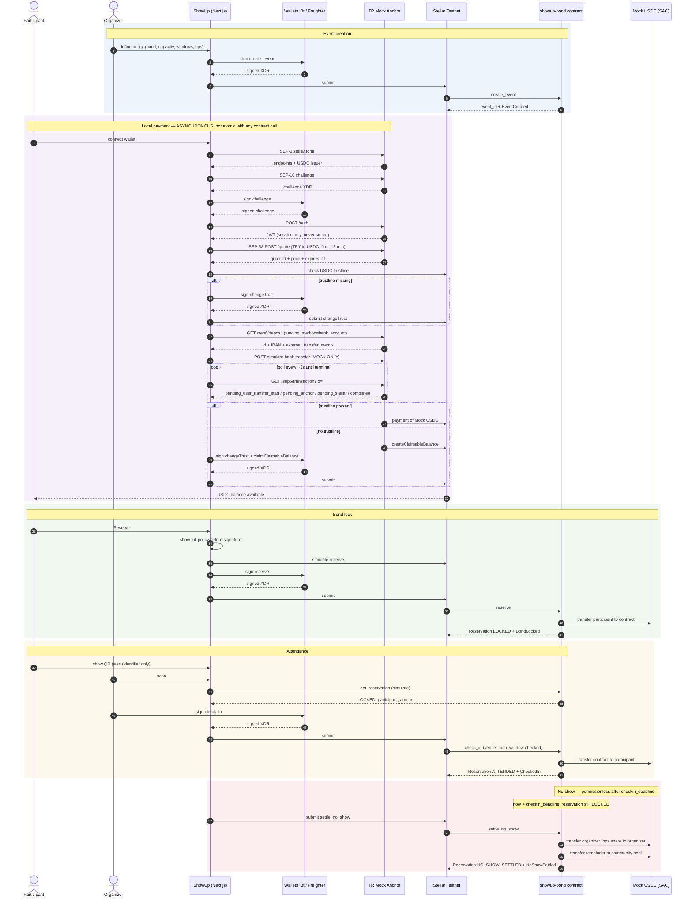

# ShowUp — P0 System Architecture

> This is the approved architecture, and checkpoints C1–C12 are implemented in
> code and local documentation. Live wallet acceptance, Anchor settlement
> evidence and public submission artifacts remain external follow-up. The design
> below is what the code follows, so it stays
> authoritative — but read it as a specification the implementation conforms to,
> not as a plan for unwritten work. Checkpoint status lives in
> **Implementation Plan**.
>
> Every version, address and network parameter was verified against a primary
> source — live Testnet RPC, installed package source, crates.io/npm, or the
> Anchor itself. Values carry the date they were verified.

## Context

Phase 0 delivered a verified toolchain and a repository foundation: a pnpm
workspace with a Next.js 16 app, a Cargo workspace, WSL-routed build scripts,
and a proven build → deploy → invoke chain on Testnet, first exercised with a
546-byte scaffold contract.

**The live deployment is `CCCDFM2MGKO5PEBS565O7FO2OL4CZYUFFRTQLUPPIIIL2JNCPUSUIRHM`.**
Addresses and transaction evidence are recorded in `docs/deployments/testnet.md`,
which is the single source of truth for them; this document does not repeat them.

This document designs the smallest production-minded architecture that can
deliver the P0 demo inside the hackathon's effective ~26-hour build window.

The authority for product scope is `SHOWUP_HACKATHON_SPEC_REVISED.md`. Where this
plan departs from that document on a *technical* decision, the departure is
called out explicitly in **Decisions Requiring Confirmation** rather than made
silently.

### Documentation set

The root README owns setup and deployment instructions; separate placeholder
documents are deliberately avoided. `docs/HACKATHON_REQUIREMENTS.md` maps scope
to evidence, `docs/SECURITY.md` contains the enforcement boundaries,
`docs/contract.md` is the contract reference, and this file remains the single
system-architecture authority.

---

## 1. Executive Architecture Decision

**A wallet-first Next.js app talking directly to one Soroban contract, with no
backend database and no server-held keys.**

Four load-bearing pieces:

1. **`showup-bond` Soroban contract** — the single source of financial truth.
   Holds every bond in its own custody, owns all policy, and is the only thing
   that can move money. The settlement asset is pinned at deploy time, so no
   organizer can point an event at an attacker-controlled token.
2. **Stellar Wallets Kit + Freighter** — the required ecosystem integration,
   behind a thin application-owned adapter so no Kit-specific call leaks into
   feature code.
3. **TR Mock Anchor (SEP-1/10/38/6)** — the local-payment path, isolated in
   one module with its own asynchronous state machine. Its funding stage is
   **not** atomic with anything on-chain and is never presented as such.
4. **Direct browser integration** — the Mock Anchor's verified CORS policy lets
   SEP-1/10/38/6 run without a token-carrying application proxy.

The defining choice is **no database in P0**. Event metadata short enough to
matter (title, venue) lives on-chain; everything else is derived from contract
getters and contract events. This removes an entire hosted dependency, its
service key, its RLS configuration and its failure modes from a one-day build.
Full reasoning in **Database Decision**.

---

## 2. Verified Technology Matrix

Every row verified on 2026-09-19 from a primary source — live network, installed
package source, or crates.io/npm. No version is carried from memory.

| Component | Choice | Verified version / value | Source | Reason |
|---|---|---|---|---|
| Network | Stellar Testnet | protocol **28**, RPC `28.0.1`, core `28.0.1` | RPC `getVersionInfo` | Mainnet is out of scope |
| Passphrase | — | `Test SDF Network ; September 2015` | RPC `getNetwork` | |
| Contract SDK | `soroban-sdk` | **28.0.0** | crates.io + local crate source | SDK major tracks protocol major |
| CLI | `stellar` | **28.0.0**, xdr 28.0.0 | `stellar --version` | Matches protocol 28 |
| Rust | stable | 1.98.1, target `wasm32v1-none` | `rustc --version` | Only Wasm target the runtime supports |
| JS SDK | `@stellar/stellar-sdk` | **17.1.0**, `engines.node >= 22.12.0` | npm + installed `.d.ts` | Current stable |
| Wallet kit | `@creit.tech/stellar-wallets-kit` | **2.6.0** | npm + installed `.d.ts` | Required ecosystem integration |
| Wallet | `@stellar/freighter-api` | **6.0.0** (direct) | installed `.d.ts` | Guaranteed P0 path |
| Frontend | Next.js / React / Tailwind | 16.3.5 / 19.2.8 / 4.3.3 | installed lockfile | Phase 0 scaffold |
| Runtime | Node.js | 24.21.0 (floor 22.12.0) | `node --version` | SDK 17 engine requirement |
| Settlement asset | Mock USDC | issuer `GBBD47IF…FLA5`, 7 decimals, `status="test"` | Anchor `stellar.toml` | Hackathon asset |
| **USDC SAC address** | derived, already deployed | **`CBIELTK6YBZJU5UP2WWQEUCYKLPU6AUNZ2BQ4WWFEIE3USCIHMXQDAMA`** | `stellar contract id asset`, interface fetched from Testnet | Pinned at deploy — see Contract API |
| Native XLM SAC | — | `CDLZFC3SYJYDZT7K67VZ75HPJVIEUVNIXF47ZG2FB2RMQQVU2HHGCYSC` | same | Reference only |
| Anchor | TR Mock Anchor | `tr-mock-anchor.fly.dev`, toml `VERSION 2.7.0` | live fetch | Local-payment requirement |
| Anchor limits | — | 50–3,000 TRY / 1 USDC min (`/health`) | live `/health` | See the contradiction note in Anchor section |
| Database | **none** | — | — | See Database Decision |

### Live network parameters that the design depends on

| Parameter | Value | Meaning here |
|---|---|---|
| `min_persistent_ttl` | 120,960 ledgers (~7 days) | A reservation written and never touched archives in a week — **must extend explicitly** |
| `max_entry_ttl` | 3,110,400 ledgers (~180 days) | Upper bound for extension |
| `min_temporary_ttl` | 720 ledgers (~1 hour) | Why no financial state goes in temporary storage |
| `contract_data_entry_size_bytes` | 65,536 (64 KiB) | The hard cap on *all* instance storage combined |
| `ledger_target_close_time_milliseconds` | 5,000 | 17,280 ledgers/day |
| RPC event retention | 120,959 ledgers (~7 days) | Confirms the no-database decision, with ~6× margin over the hackathon |

Source: `stellar network settings --network testnet` and a live `getEvents` range
probe, both 2026-09-19.

> Three numbers in the official `stellar-dev-skill` files are stale against live
> Testnet and would have been wrong if copied: persistent TTL floor (the skill
> says ~120 days, live is 7), and the `try_*` return type (see **Testing
> Matrix**). The skills' *semantics* held up well; their *numbers* did not. This
> is exactly why the brief asked for independent verification.

---

## 3. Final Repository Structure

```text
ShowUp/
├─ apps/web/
│  ├─ app/
│  │  ├─ page.tsx                          public landing
│  │  ├─ events/[id]/page.tsx              event detail + reserve
│  │  ├─ reservations/page.tsx             participant's reservations
│  │  ├─ reservations/[id]/page.tsx        reservation detail + QR pass
│  │  ├─ wallet/page.tsx                   balances, trustline, Anchor funding
│  │  ├─ organizer/page.tsx                organizer's events
│  │  ├─ organizer/events/new/page.tsx     create event
│  │  ├─ organizer/events/[id]/page.tsx    reservations + settlement
│  │  ├─ organizer/events/[id]/scan/page.tsx   QR scanner
│  ├─ components/
│  │  ├─ ui/                               shadcn primitives
│  │  ├─ wallet/                           connect button, network guard
│  │  ├─ tx/                               transaction state UI
│  │  └─ debug/                            jury evidence panel
│  ├─ lib/
│  │  ├─ wallet/                           Wallets Kit adapter (module boundary)
│  │  ├─ anchor/                           SEP client + state machine
│  │  ├─ stellar/                          RPC, Horizon, trustline, amounts
│  │  ├─ contract/                         typed contract facade
│  │  ├─ qr/                               payload codec + scanner binding
│  │  └─ domain/                           shared types, Zod schemas, policy math
│  └─ scripts/smoke-test.mts               existing Phase 0 toolchain probe
│
├─ packages/
│  └─ showup-bond-client/                  GENERATED bindings, not hand-written
│
├─ contracts/showup-bond/
│  ├─ src/lib.rs                           entry points only
│  ├─ src/types.rs                         Event, Reservation, enums, errors
│  ├─ src/storage.rs                       keys + TTL policy, the only storage access
│  ├─ src/events.rs                        #[contractevent] definitions
│  └─ src/test/                            one file per behaviour group
│
├─ scripts/
│  ├─ preflight.mjs                        existing
│  ├─ setup-identities.sh                  existing
│  ├─ deploy-testnet.sh                    existing, extended for constructor args
│  └─ seed-demo-event.sh                   compressed-window demo fixture
│
└─ docs/                                   see Documentation Architecture
```

### Why `lib/` directories instead of `packages/*`

The brief asks for boundaries around `packages/anchor`, `packages/stellar`,
`packages/contract-client` and `packages/shared`. The **boundaries** are worth
having; four extra pnpm packages are not. Every one of those modules has exactly
one consumer — the web app — because Next.js Route Handlers and React components
live in the same package. Separate workspace packages would buy nothing but
tsconfig references, build ordering and publish config, none of which pay for
themselves in a 26-hour window. The specification itself says not to spend
hackathon time perfecting workspace tooling.

The boundaries are therefore enforced by directory and by an ESLint
`no-restricted-imports` rule expressing the dependency table in **Component
Boundaries**, not by package manifests.

The one genuine exception is `packages/showup-bond-client`: `stellar contract
bindings typescript` emits a standalone package, so it is left where the tool
puts it. It is generated output and is never edited by hand.

---

## 4. Component Boundaries

Dependency direction is strictly downward. Nothing below may import from
anything above it.

| Layer | Module | May import |
|---|---|---|
| 4 | `app/`, `components/` | everything below |
| 3 | `lib/contract`, `lib/anchor`, `lib/qr` | `lib/stellar`, `lib/wallet`, `lib/domain` |
| 2 | `lib/wallet` | `lib/domain` |
| 1 | `lib/stellar` | `lib/domain`, `packages/showup-bond-client` |
| 0 | `lib/domain` | nothing |

`lib/domain` importing nothing is what keeps the graph acyclic. There is no
`lib/utils`.

### `lib/domain`

- **Responsibility.** Types and pure functions shared by every other module:
  `EventPolicy`, `ReservationView`, status enums mirrored from the contract, Zod
  schemas for form input and QR payloads, basis-point and 7-decimal amount
  arithmetic, and the *display-side* eligibility predicates (`canCancel`,
  `canCheckIn`, `isSettleable`) which take an explicit `nowSeconds` argument.
- **Public interface.** Types, schemas, pure functions. No I/O.
- **Prohibited.** Any network call, any `Date.now()`, any React, any SDK import.
  `nowSeconds` is always a parameter so the ledger clock can be supplied.
- **Tests.** Vitest. Amount conversion round-trips, bps split exactness including
  the remainder case, predicate boundaries at exactly `deadline` and
  `deadline ± 1`.
- **Failure modes.** Rounding drift between UI estimate and contract result.
  Mitigated by using the same integer math the contract uses and never
  formatting through `Number` for financial values.

### `lib/stellar`

- **Responsibility.** All raw network access: RPC client construction, Horizon
  account/balance reads, latest-ledger timestamp, trustline detection and
  `changeTrust` building, transaction assembly/simulation/submission/polling,
  and mapping RPC results onto a single `TxResult` union.
- **Public interface.** `getRpc()`, `getLedgerNow()`, `getAccountAssets()`,
  `hasTrustline()`, `buildChangeTrust()`, `simulate()`, `submitAndConfirm()`,
  plus the `TxResult` / `TxFailure` types.
- **Prohibited.** Knowing what a ShowUp event is. No wallet UI. No Anchor
  knowledge. Never signs anything — it receives already-signed XDR.
- **Tests.** Vitest against recorded RPC fixtures for result mapping;
  live-network behaviour covered by the existing smoke test.
- **Failure modes.** RPC timeout, rate limiting, archived-entry restore required,
  simulation succeeding while submission fails. Each maps to a distinct
  `TxFailure` variant so the UI can say something useful.

**Verified call shapes for `@stellar/stellar-sdk` 17.1.0.** These four are
counter-intuitive enough that getting them wrong costs an hour each, and all four
are wrong in at least one piece of official documentation:

- `SorobanRpc` does not exist. The root export is an `rpc` namespace;
  `rpc.Server` is an alias of `RpcServer`.
- **`rpc.assembleTransaction(tx, sim)` returns a `TransactionBuilder`, not a
  `Transaction`.** It needs `.build()`.
- **`isSimulationSuccess` returns `true` for a restore response**, because
  `SimulateTransactionRestoreResponse extends SimulateTransactionSuccessResponse`.
  The check order must be `isSimulationError` → `isSimulationRestore` → success.
- **`getLedgerEntries(...keys)` is variadic.** Passing an array fails with
  `[].toXdr is not a function`. The SDK's own JSDoc example gets this wrong, and
  also names the `LedgerKeyContractData` field `contractId` when it is `contract`
  and takes an `ScAddress`.

For reads, 17.x adds `server.queryContract<T>(contractId, method, args,
networkPassphrase)`, which simulates and spec-decodes in one call. `lib/contract`
uses it for every getter rather than hand-assembling read transactions. Always
pass `networkPassphrase` — omitting it costs an extra `getNetwork()` round trip
per read, and the event page issues several.

`server.prepareTransaction()` is avoided: it collapses simulate + assemble but
**throws** on a restore-required simulation instead of surfacing
`restorePreamble`, which is exactly the case `lib/stellar` needs to handle.

### `lib/wallet`

- **Responsibility.** The single place Stellar Wallets Kit is touched. Exposes an
  application-shaped `Wallet` port and a Kit-backed adapter, plus the React
  provider that holds connection state.
- **Public interface.** `connect()`, `disconnect()`, `getAddress()`,
  `getNetwork()`, `signTransaction(xdr)`, `signAuthEntry(...)` if required, and
  a `useWallet()` hook.
- **Prohibited.** Building transactions. Knowing about events, reservations or
  the Anchor. Leaking Kit types across its boundary — callers see only
  application types.
- **Tests.** Vitest against a fake adapter implementing the same port; the port
  is what feature code depends on, so every feature test can run without a
  browser extension.
- **Failure modes.** Extension absent, user rejection, wrong network, address
  changed mid-session. Each surfaces as a typed error, never a raw Kit throw.

### `lib/contract`

- **Responsibility.** The typed facade over `showup-bond`. Wraps the generated
  bindings, supplies the contract id, converts between contract scalars and
  `lib/domain` types, and exposes read (`simulate-only`) and write
  (`sign + submit`) operations as named domain actions.
- **Public interface.** `getEvent`, `getEventCount`, `getReservation`,
  `getConfig` for reads; `createEvent`, `reserve`, `cancelReservation`,
  `checkIn`, `cancelEvent`, `claimCancelledRefund`, `settleNoShow` for writes.
  Also `readEventLog()` over contract events.
- **Prohibited.** Deciding eligibility. It may *surface* a contract error but
  must never pre-judge a financial rule the contract owns.
- **Tests.** Vitest on error-code → domain-error mapping; real behaviour is
  covered by contract tests and the E2E flow.
- **Failure modes.** Contract error codes, capacity lost between simulation and
  submission, stale reads. Contract errors are mapped by code, never by string
  matching.

### `lib/anchor`

- **Responsibility.** Every SEP interaction, expressed as domain operations, plus
  the deposit state machine. Owns JWT lifetime and quote expiry.
- **Public interface.** `discover()`, `getIndicativePrice()` (public, no auth),
  `authenticate(signer)`, `getFirmQuote()`, `startDeposit()`,
  `simulateMockBankTransfer()` (named so its nature cannot be misread),
  `pollDeposit()`, and the pure `depositReducer()` exposing the states in
  **Anchor State Machine**. Claim transaction assembly belongs to `lib/stellar`.
- **No SEP-12 call.** The Anchor states that SEP-6 needs authentication only.
  Omitting it removes a round trip and any appearance of collecting real KYC
  data.
- **Prohibited.** Touching the contract. Holding keys. Persisting a JWT anywhere
  durable. Being imported by `lib/contract`.
- **Tests.** Vitest over recorded SEP responses: challenge validation rejects a
  bad home domain or a bad server signature; status transitions; expiry
  handling. No live Anchor call in unit tests.
- **Failure modes.** Anchor down, JWT expired, quote expired, deposit stuck in
  `pending_trust`, deposit failed. Each has a named recovery action.

### `lib/qr`

- **Responsibility.** Encode and decode the reservation pass payload, and wrap
  the camera scanner.
- **Public interface.** `encodePass()`, `decodePass()` (Zod-validated),
  `useScanner()`.
- **Prohibited.** Any claim to authorise anything. The payload is an identifier,
  never a capability.
- **Tests.** Vitest round-trip; malformed and hostile payloads rejected.
- **Failure modes.** Camera permission denied, unreadable code, payload for a
  different event. All handled in the scanner UI.

### `contracts/showup-bond`

- **Responsibility.** Every financial rule. See **Contract API**.
- **Prohibited.** Anything cosmetic — images, descriptions, slugs, identity.
- **Tests.** Rust unit tests, positive and negative, per **Testing Matrix**.

---

## 5. End-to-End Sequence



The Anchor block and the contract blocks are separated on purpose. Funds arriving
from the Anchor and a bond being locked are two independent events with no shared
transaction. Nothing in the UI, the README or the pitch describes them as atomic.

---

## 6. On-chain State Model

### Config — instance storage, written once by `__constructor`

| Field | Type | Note |
|---|---|---|
| `token` | `Address` | The Mock USDC SAC, verified as `CBIELTK6YBZJU5UP2WWQEUCYKLPU6AUNZ2BQ4WWFEIE3USCIHMXQDAMA` and already deployed on Testnet. **Pinned at deploy.** Not settable per event. |
| `community_pool` | `Address` | Fixed team-controlled Testnet address. Not settable per event. |
| `event_count` | `u64` | Monotonic id source, and the frontend's enumeration bound. |

Pinning `token` and `community_pool` globally removes two attack surfaces that a
per-event address would open: an organizer pointing an event at a worthless
token, and an organizer naming themselves as the "community pool" to capture the
whole no-show split. Both are real, both are free to eliminate, and neither
costs P0 anything — the specification already describes a single settlement
asset and a single fixed pool address.

### Event — persistent storage, key `Event(u64)`

| Field | Type | Note |
|---|---|---|
| `id` | `u64` | |
| `organizer` | `Address` | |
| `verifier` | `Address` | Set to `organizer` at creation. Field exists so P1 can separate roles without a migration. |
| `title` | `String` | Bounded length. On-chain because of the no-database decision. |
| `venue` | `String` | Bounded length. |
| `bond_amount` | `i128` | Stroops-style integer, 7 decimals. |
| `capacity` | `u32` | |
| `reserved_count` | `u32` | Only ever incremented by `reserve`. |
| `start_time` | `u64` | Unix seconds. |
| `checkin_start` | `u64` | |
| `checkin_deadline` | `u64` | |
| `cancellation_deadline` | `u64` | |
| `organizer_bps` | `u32` | |
| `community_bps` | `u32` | |
| `status` | `EventStatus` | |

`EventStatus` is **`Active` | `Cancelled`** — two variants, not three. The
specification lists a `Closed`/`Finished` state, but nothing in P0 would ever set
it: an event becomes inert through timestamp comparison, not through a status
write. A status no code transitions into is dead state that every invariant then
has to reason about. If P1 adds an explicit close, it is an additive change.

### Reservation — persistent storage, key `Reservation(u64, Address)`

| Field | Type | Note |
|---|---|---|
| `event_id` | `u64` | |
| `participant` | `Address` | |
| `amount` | `i128` | Snapshot of the bond actually paid. Settlement uses this, never the current event value. |
| `reserved_at` | `u64` | |
| `status` | `ReservationStatus` | |

Keying by `(event_id, participant)` makes duplicate reservation structurally
impossible — there is one slot per participant per event — rather than something
a check has to catch.

Storing `amount` on the reservation rather than reading `event.bond_amount` at
settlement time means a reservation always settles for exactly what was locked,
even if a future version ever allowed policy edits.

### Reservation state transitions

```text
                      reserve()
                          │
                          ▼
                      ┌────────┐
                      │ Locked │ ── funds held by contract
                      └───┬────┘
                          │
      ┌──────────────┬────┴─────┬───────────────────┐
      │              │          │                   │
 check_in()   cancel_reservation()   claim_cancelled_event_refund()   settle_no_show()
 verifier auth   participant auth        permissionless                permissionless
 window open     ≤ cancel deadline       event Cancelled               > checkin_deadline
      │              │          │                   │
      ▼              ▼          ▼                   ▼
 ┌──────────┐  ┌───────────┐ ┌──────────┐  ┌────────────────┐
 │ Attended │  │ Cancelled │ │ Refunded │  │ NoShowSettled  │
 └──────────┘  └───────────┘ └──────────┘  └────────────────┘
      └──────────────┴──────────┴───────────────────┘
                          │
                   all terminal — no further transition
```

Five states, one of which is non-terminal. **Every money-moving entry point
begins by asserting `status == Locked`.** That single assertion is what prevents
double refund, double check-in and double settlement — they are not three
separate defences but one.

The four terminal states are distinguished only because the participant UI must
show *why* a bond came back. Financially they are identical: funds have left
contract custody for this reservation and can never leave again.

### Event state transitions

```text
create_event() ──► Active ──► cancel_event() ──► Cancelled
                     │                              │
                     │ reserve / check_in           │ only claim_cancelled_event_refund
                     │ / cancel_reservation         │ may move funds
                     │ / settle_no_show             │
```

`cancel_event` only flips the status. It never iterates participants — see
**Contract API**.

---

## 7. Contract API

Eleven entry points. The brief listed `initialize` and the two optional helpers
`is_refundable` / `is_settleable`; none of the three survive.

- **`initialize` is replaced by `__constructor`.** A constructor runs exactly once,
  atomically, at deploy. An `initialize()` method has to defend itself against
  being called twice, and that defence is a classic source of reinitialization
  bugs. Using the constructor deletes the threat instead of guarding it.
- **`is_refundable` / `is_settleable` are dropped.** They would duplicate, in a
  second place, rules the entry points already enforce — and a UI that trusted
  them would still have to handle the real call failing. The frontend computes
  the same predicates from `get_event` + `get_reservation` + the ledger
  timestamp, and treats them as hints only.

`get_event_count` is added because the no-database decision makes it load-bearing:
it is how the frontend enumerates events without an off-chain index.

### Writes

| Method | Auth | Preconditions | Effects | Event |
|---|---|---|---|---|
| `__constructor(token, community_pool)` | deploy-time only | — | writes instance config, `event_count = 0` | — |
| `create_event(organizer, title, venue, bond_amount, capacity, start_time, checkin_start, checkin_deadline, cancellation_deadline, organizer_bps, community_bps) -> u64` | `organizer.require_auth()` | `bond_amount > 0`; `capacity > 0`; `organizer_bps + community_bps == 10_000`; `cancellation_deadline <= checkin_start <= checkin_deadline`; `checkin_start <= start_time <= checkin_deadline`; title/venue within length bounds | `event_count += 1`; writes `Event`; `verifier = organizer` | `EventCreated` |
| `reserve(event_id, participant)` | `participant.require_auth()` | event exists and `Active`; `now < checkin_deadline`; `reserved_count < capacity`; no existing `Reservation(event_id, participant)` | `token.transfer(participant → contract, bond_amount)`; writes `Reservation{Locked, amount: bond_amount}`; `reserved_count += 1` | `BondLocked` |
| `cancel_reservation(event_id, participant)` | `participant.require_auth()` | reservation `Locked`; event `Active`; `now <= cancellation_deadline` | `token.transfer(contract → participant, amount)`; status `Cancelled`; `reserved_count -= 1` | `ReservationCancelled` |
| `check_in(event_id, participant)` | `event.verifier.require_auth()` | reservation `Locked`; event `Active`; `checkin_start <= now <= checkin_deadline` | `token.transfer(contract → participant, amount)`; status `Attended` | `CheckedIn` |
| `cancel_event(event_id)` | `event.organizer.require_auth()` | event `Active` | status `Cancelled`. **No participant iteration, no transfers.** | `EventCancelled` |
| `claim_cancelled_event_refund(event_id, participant)` | none | event `Cancelled`; reservation `Locked` | `token.transfer(contract → participant, amount)`; status `Refunded` | `RefundClaimed` |
| `settle_no_show(event_id, participant)` | none | event `Active`; reservation `Locked`; `now > checkin_deadline` | splits `amount` by bps; two transfers out; status `NoShowSettled` | `NoShowSettled` |

### Reads (simulation only, no transaction)

| Method | Returns |
|---|---|
| `get_config()` | `{ token, community_pool }` — also feeds the jury debug panel |
| `get_event_count()` | `u64` |
| `get_event(event_id)` | `Event`, or `NotFound` error |
| `get_reservation(event_id, participant)` | `Option<Reservation>` |

### Why two settlement calls are permissionless

`claim_cancelled_event_refund` and `settle_no_show` take no authorization, and
that is deliberate rather than lax. In both, **every destination is already fixed
by contract state**: the refund can only go to `reservation.participant`, and the
no-show split can only go to `event.organizer` and the pinned `community_pool`.
A caller cannot redirect a single stroop. What permissionless buys is that
settlement does not depend on the organizer choosing to act — which is precisely
the property that makes the bond credible to a participant, and it is what the
specification asks for.

Requiring participant auth on the refund claim would be strictly worse: a
participant who lost wallet access could never be refunded, and nobody could help
them.

### The authorization tree — the detail that is easiest to get fatally wrong

`reserve` produces a **two-node** auth tree for the participant, because the
nested SAC call raises its own `require_auth`:

```text
root:  showup_bond.reserve(event_id, participant)
 └─ sub: <USDC SAC>.transfer(participant, <showup_bond>, bond_amount)
```

Authorizing the root does **not** cascade to the sub-node. Both are required, and
the simulation builds both automatically — neither the CLI nor the JS client
needs them hand-written.

**`participant.require_auth()` must stay in `reserve` even though the SAC checks
it again.** Removing it as "redundant" is the single most dangerous edit anyone
could make to this contract: without it, anyone could call
`reserve(event_id, victim)` and consume a pre-signed inner auth entry belonging to
the victim. The official Stellar security guidance calls this the most common
real-world auth bug. A contract test asserts the exact two-node tree via
`env.auths()` precisely so that deleting the line breaks a test rather than
shipping.

Every privileged check loads the address **from storage** and authorizes that —
`event.organizer.require_auth()` — never an address passed in as a parameter.
`require_auth` on a caller-supplied address proves the caller controls it, which
says nothing about whether they are allowed to act.

### Amount arithmetic

```text
organizer_amount = amount * organizer_bps / 10_000     // checked_mul, checked_div
community_amount = amount - organizer_amount           // remainder, never a second division
```

Deriving the second leg by subtraction rather than by a second multiply-divide is
what guarantees the two legs sum to exactly `amount` with no dust stranded in the
contract.

**Explicit `checked_*` arithmetic with an `Overflow` error variant, not bare
operators.** `overflow-checks = true` is set in the release profile and does make
an overflow a safe rollback rather than silent corruption — but it surfaces as an
opaque host abort that the frontend cannot map to a message and the user cannot
act on. `checked_mul(...).ok_or(Error::Overflow)?` fails cleanly, is typed, and
survives someone building with the wrong profile. Multiply-before-divide in the
bps split is the only place this is realistically reachable.

`bond_amount > 0` is validated at `create_event`, and the contract transfers
`event.bond_amount` itself rather than accepting an amount from the caller, so a
negative amount is unreachable by construction. `i128` admits negatives and a
negative `transfer` is a withdrawal — worth knowing even though this design
closes the door.

### Token architecture: classic trustlines and SAC balances are not the same thing

Treating these as interchangeable is the most consequential asymmetry in the
design, so it is stated explicitly.

| | Participant (`G…` account) | ShowUp contract (`C…` address) |
|---|---|---|
| What a USDC balance *is* | a classic trustline — there is no parallel storage | an entry in the SAC's own contract storage |
| Trustline needed to receive? | **Yes.** No trustline, transfer fails. | **No, and none is possible.** |
| Setup before holding bonds | must `changeTrust` (0.5 XLM reserve, locked not spent) | **none — works the moment it is deployed** |
| Balance ceiling | `i64::MAX` stroops | full `i128` |
| Affected by issuer flags | yes — freeze, clawback, auth-required | clawback only, and only if the flag was set when the balance was created |

Practical consequences, both load-bearing:

- **The contract needs no setup at all to custody bonds.** There is no trustline
  step in deployment.
- **The inbound leg is self-verifying.** A participant can only `reserve` by
  transferring USDC in, which already requires a trustline. The contract does not
  need to check.
- **The outbound leg is where a missing trustline bites** — covered above under
  the push-payment failure mode.

The token address is obtained by *derivation*, not lookup:
`Asset.contractId(networkPassphrase)` in JS, `stellar contract id asset` on the
CLI. Derivation is pure computation and says nothing about whether the SAC exists
— those are separate facts. For this project both are settled: the Mock USDC SAC
is derived as `CBIELTK6…HMXQDAMA` and was confirmed already deployed on Testnet by
fetching its interface, so no `stellar contract asset deploy` step is needed. The
deploy script probes rather than assumes, because deploying an existing SAC errors
rather than no-oping.

The same asset has a **different SAC address on Testnet and Mainnet** — the
network passphrase is part of the derivation preimage. Hard-coding one address
without the network is a latent mainnet bug, which is one more reason the address
is a constructor argument rather than a constant in the contract.

Moving tokens **out** of contract custody needs no special auth setup:
`token.transfer(&env.current_contract_address(), &to, &amount)` works because the
SAC is called *directly* by ShowUp, and a contract's direct calls are always
considered authorized. `authorize_as_current_contract` would only be needed if the
call were routed through an intermediary contract — which is a reason to keep
calling the SAC directly and not introduce one.

The security corollary is worth stating plainly: **because the contract can move
its own funds with no signature, the entirety of bond custody security is the
`require_auth`, state and deadline checks guarding each entry point.** There is no
second line of defence behind them.

The contract stores and transfers integer token units only; `Config` deliberately
contains just the pinned `token` and `community_pool` addresses. Mock USDC is a
classic Stellar asset with 7 decimal places, and the frontend's domain/amount
layer owns conversion between display strings and those integer units. No
`decimals` field is stored on-chain, so the constructor, state table, getter ABI
and generated bindings all describe the same two-field configuration.

### Storage layout and TTL policy

| Data | Storage | Why |
|---|---|---|
| `token`, `community_pool`, `event_count` | **instance** | Three small values, needed on almost every call, and instance entries do not appear in the footprint. Well inside the 64 KiB cap that covers *all* instance keys combined. |
| `Event(u64)` | **persistent** | Financial policy. Must be restorable. |
| `Reservation(u64, Address)` | **persistent** | Holds a bond. Must be restorable. |
| anything | never **temporary** | Temporary entries are **permanently deleted** at TTL zero with no recovery path. No money-bearing state can live there. |

No per-reservation data goes in instance storage — not because of taste but
because the entire instance entry is deserialised on *every* invocation, so N
reservations would make every `check_in` pay O(N) and hand an attacker a
fee-griefing surface.

TTL, with the live floor at ~7 days and a max of ~180 days:

```rust
const DAY_IN_LEDGERS: u32 = 17_280;          // 5s target close time
const BUMP_THRESHOLD:  u32 = 30 * DAY_IN_LEDGERS;   //   518_400
const BUMP_TO:         u32 = 90 * DAY_IN_LEDGERS;   // 1_555_200, under max 3_110_400
```

Extended on **every write**, including the write that creates the entry — the
7-day floor is not enough for an event booked weeks out with a claim window
afterwards. Clamped against `env.storage().max_ttl()` at runtime rather than
against the hard-coded ceiling, because the network setting changes by validator
vote.

**TTL is never used as business logic.** Anyone can extend anyone's entry TTL with
`ExtendFootprintTTLOp`, with no contract authorization at all. Every deadline is
an absolute `u64` timestamp stored in the entry and compared against
`env.ledger().timestamp()`.

### Errors

A single `#[contracterror]` enum with stable numeric codes, consumed by
`lib/contract` **by code, never by message**:

```text
 1 NotFound              7 CheckInWindowClosed
 2 NotActive             8 CancellationDeadlinePassed
 3 AlreadyReserved       9 SettlementTooEarly
 4 EventFull            10 InvalidBasisPoints
 5 NotLocked            11 InvalidSchedule
 6 CheckInNotOpen       12 InvalidAmount
                        13 Overflow
                        14 EventNotCancelled
```

`NotActive` (2) and `EventNotCancelled` (14) are deliberately separate. The first
means an event has already been cancelled and so cannot be reserved, cancelled
or settled against; the second means an event is still active and so has nothing
to claim a refund from. They are opposite conditions, and one shared code would
leave the frontend unable to render a correct message for either.

`NotLocked` (5) is the one that fires for every double-spend attempt — double
check-in, double refund, double settlement. One code, one message, one place in
the UI.

Codes start at 1, are grouped with gaps for growth, and are **never renumbered
across an upgrade** — they are public ABI that the frontend matches on. The JS
SDK extracts them with the literal pattern `Error(Contract, #N)` and the
generated bindings populate the lookup table automatically, which is why every
user-visible rejection must be a distinct returned variant rather than a
`panic!`. A bare `panic!("message")` surfaces as an opaque host error the
frontend cannot map; `panic_with_error!` is used where a helper cannot return.

### The one push-payment failure mode, stated plainly

`check_in` refunds the participant in the same transaction the organizer signs.
That is a deliberate UX choice — one transaction, instant refund, the strongest
moment in the demo — but it means the organizer's transaction depends on the
participant's account still being able to receive USDC.

A participant who deletes their USDC trustline between reserving and attending
makes `check_in` revert. Nothing is lost and nothing is stuck: the reservation
stays `Locked`, the scanner shows "this participant can no longer receive USDC —
they need to re-add the trustline", and the check-in succeeds on a rescan.

Three reasons this is acceptable rather than a flaw worth redesigning around:
the participant necessarily had a trustline to reserve in the first place;
removing it is a deliberate act against their own interest; and the alternative —
`check_in` marks attended, participant claims separately — doubles the
transactions at the demo's climax.

The other three money paths are unaffected. `cancel_reservation` and
`claim_cancelled_event_refund` are initiated by the participant, so only their own
transaction can fail. `settle_no_show` pays the organizer and the pinned community
pool, both team-controlled accounts that hold trustlines. **No payout is ever
batched across participants**, so one bad destination can never block anyone else.

### What the contract enforces vs what the web app enforces

| Rule | Enforced by |
|---|---|
| Bond amount, capacity, bps split, every deadline | **Contract.** Authoritative. |
| Who may check in, cancel, create | **Contract**, via `require_auth`. |
| One reservation per participant per event | **Contract**, structurally via the storage key. |
| No double settlement | **Contract**, via the `Locked` assertion. |
| Showing the policy before signature | Web app. A UX obligation, not a security control. |
| Greying out an ineligible button | Web app. A convenience; the contract still rejects the call. |
| QR freshness | Web app. **Explicitly not a security control** — see QR design. |

The web app never decides whether money may move. Every UI predicate is a
prediction of what the contract will do, and is allowed to be wrong.

---

## 8. Event Cancellation: pull, not push

`cancel_event` writes one status field and returns.

A push design — iterating reservations and refunding each — fails for reasons
that are not stylistic. The loop is unbounded by anything the contract controls,
so its cost scales with attendance; it can exceed the per-transaction resource
budget and then the organizer simply *cannot* cancel; and a partial failure
mid-loop leaves some participants refunded and others not, with no clean retry.

Pull-based refund makes each claim a fixed-cost, independently retryable
transaction that touches exactly one reservation. The participant pays the fee
for their own refund, which also removes any incentive for an organizer to stall.

The cost is that a participant must take an action to get their money. The UI
covers this: a cancelled event turns the reservation card into a single
prominent **Claim refund** button.

---

## 9. Capacity and Concurrency

The race: `capacity = 20`, 20 reservations already exist, A and B both submit
`reserve` at the same moment.

**Both may simulate successfully.** Simulation runs against a recent ledger
snapshot where a seat still appears free. Simulation is a fee and footprint
estimate, not a reservation of the outcome.

**Only one can be applied.** Both transactions declare the same `Event(id)` ledger
entry as a read-write footprint entry. The network serialises conflicting
footprints, so the second transaction executes against the updated state, sees
`reserved_count == capacity`, and fails with `EventFull`.

Two design consequences:

1. **`reserved_count` is read and compared inside `reserve`, never trusted from
   the client.** The capacity check is part of the same atomic invocation as the
   increment and the transfer. There is no window between check and effect.
2. **The UI must treat a successful simulation as provisional.** The reserve
   button never shows success on simulation. It shows success only after the
   transaction is confirmed in a ledger.

Surfacing the failure: `EventFull` arriving at *submission* rather than
simulation is a distinct UI case — the user already signed. The message is
explicit about what happened and what it cost them: the seat was taken while the
transaction was in flight, no bond was transferred, and the network fee was
spent. The page then refetches the event and offers the waitlist-free reality:
the event is full.

`cancel_reservation` decrements `reserved_count`, which frees the seat again.
`check_in`, `settle_no_show` and `claim_cancelled_event_refund` do **not**
decrement — the seat was genuinely consumed.

---

## 10. Time Handling

Every financial deadline is evaluated by the contract against
`env.ledger().timestamp()`. No timestamp is ever accepted as a parameter on a
money-moving call. That is the whole of the security story.

The browser clock is used for exactly one thing: cosmetic countdown ticking
between refreshes. Every eligibility decision the UI displays — is cancellation
still open, has the check-in window started, can this be settled — is computed
against the **ledger** timestamp fetched from RPC, passed explicitly as
`nowSeconds` into the `lib/domain` predicates. This is why those predicates take
the clock as a parameter instead of calling `Date.now()` internally: it makes
using the wrong clock a type-level impossibility rather than a review comment.

A user whose machine clock is wrong therefore sees correct eligibility, and a
user who changes their clock changes nothing.

### Demonstrating deadlines in a live demo

Compressed windows are set **at event creation**, by `scripts/seed-demo-event.sh`,
using values relative to the current ledger time:

```text
cancellation_deadline = now - 60     (already passed, so the no-show path is reachable)
checkin_start         = now - 60
checkin_deadline      = now + 180
start_time            = now + 60
```

A second fixture seeds a reservation whose `checkin_deadline` is already in the
past, so `settle_no_show` is immediately demonstrable.

This is deployment configuration, not contract behaviour. **No `force_no_show`,
no admin time override, no debug-only entry point** — nothing exists in the
contract that would be unsafe in production. The demo bends the event schedule,
never the rules.

---

## 11. Anchor State Machine

The funding flow is the only long-lived asynchronous process in the product, and
the only one that can be interrupted by a page reload. It gets its own machine,
deliberately separate from the transaction machine in **Transaction UX**.

This design is built on the Mock Anchor's own `/guide` and a live probe of every
GET endpoint, not on the hackathon `SKILL.md` — which is wrong or outdated on six
separate points, listed at the end of this section.

```text
                    IDLE
                     │ user taps "Add funds with TRY"
                     ▼
                DISCOVERING            SEP-1 stellar.toml
                     │
                     ▼
                  PRICING              SEP-38 /price — PUBLIC, no wallet needed
                     │                 (this is why /events/[id] can show
                     ▼                  "200 TRY ≈ 4.08 USDC" before connect)
              AUTHENTICATING           SEP-10 challenge → wallet signature → JWT
                     │
                     ▼
                  QUOTING              POST /sep38/quote — firm, 15 min, single-use
                     │
                     ▼
              DEPOSIT_STARTED          GET /sep6/deposit?funding_method=bank_account
                     │                 → id + IBAN + external_transfer_memo
                     ▼
            AWAITING_BANK_TRANSFER     status: pending_user_transfer_start
                     │ simulate-bank-transfer   (MOCK ONLY)
                     ▼
              ANCHOR_PROCESSING ──────► TREASURY_LOW
              pending_anchor /          pending_reason: "treasury_low"
              pending_stellar           waits, does NOT fail
                     │
        ┌────────────┴─────────────┐
        ▼                          ▼
   COMPLETED                  COMPLETED
   + payment                  + claimable_balance_id
   USDC in wallet                  │
                                   ▼
                          CLAIM_REQUIRED
                          changeTrust + claimClaimableBalance
                          (one transaction)
                                   │
                                   ▼
                             USDC in wallet
                     │
                   ERROR  (terminal; `refunds` shows TRY returned)
```

### The correction that matters most: there is no trustline wall

The plan previously assumed `pending_trust` was the primary no-trustline path.
**It is not.** The Mock Anchor advertises `features.claimable_balances: true`, and
its `/guide` states that when the destination account has no USDC trustline it
issues a **claimable balance** with the participant as sole unconditional
claimant. The deposit still reaches `completed`; it does not hang.

`pending_trust` does not appear in the authoritative status table at all — only in
`SKILL.md` and, qualified, in `llms-full.txt` as what happens "when the wallet did
not opt into claimable balances". It is handled as a defensive extra case, not as
the main path.

This is better news than a wall, and it changes the UI: the trustline is
*recommended before* depositing, but its absence is recoverable afterwards with a
single transaction combining `changeTrust` and `claimClaimableBalance`. Reserve
cost is **0.5 XLM**, locked not spent (base reserve 5,000,000 stroops, verified
live).

### Recovery edges

| State | Trigger | Recovery |
|---|---|---|
| `CLAIM_REQUIRED` | `completed` with a `claimable_balance_id` | One transaction: `Operation.changeTrust` + `Operation.claimClaimableBalance`. The highest-value recovery path in the product, presented as a prominent card. |
| `TREASURY_LOW` | `pending_reason: "treasury_low"` | Nothing to do but wait — the shared sandbox treasury is empty. **Surfaced explicitly**, because a silent spinner here would look like a broken demo when it is not. A pre-demo `/health` check reads the treasury balance. |
| Quote expired | `expires_at` passed | Quotes are single-use, user-bound, 15 min by default (`expire_after` accepts up to 1 hour). **An expired quote does not fail the deposit — the Anchor silently falls back to the live rate.** So the UI never blocks on expiry; it warns that the final rate may differ and re-prices. Getting this wrong in the other direction — hard-failing — would be a self-inflicted bug. |
| JWT expired | **HTTP 403**, `{"type":"authentication_required"}` | Silent re-authentication, one wallet signature. Note: 403, not 401 — `SKILL.md`'s troubleshooting table is wrong here. Lifetime is undocumented, so the client reads `exp` from the token rather than assuming. |
| `pending_trust` | legacy path | Same action as `CLAIM_REQUIRED`: add the trustline. |
| `ERROR` | terminal | Anchor message plus `refunds`, which shows the TRY returned to the sandbox balance. Retry starts a fresh deposit. |

### SEP-12 is not called

The Anchor states plainly that SEP-6 deposit and withdraw do not require SEP-12 —
authentication alone suffices, and a `PUT /sep12/customer` with an empty object
returns `ACCEPTED`. **P0 makes no SEP-12 call at all.** The only reason to add one
later is the off-ramp: a Turkish IBAN submitted as `bank_account_number` is
mod-97 validated and used for payout, which only matters for the P1 withdraw path.

### Polling

The Anchor processes on-ramps every 3 seconds and advertises `eta: 5`, so polling
`GET /sep6/transaction?id=…` at ~3 s is right-sized. Note the response is wrapped:
the status is at `transaction.status`, not at the top level.

An `on_change_callback` alternative exists — the Anchor POSTs each status change
with an Ed25519 `Signature: t=<unix>, s=<base64>` header over
`"<t>.<host>.<rawBody>"`, verifiable against `SIGNING_KEY`. It would remove
polling entirely, but it needs a publicly reachable URL, which local development
does not have. **P0 polls. The callback is noted as a clean P1 upgrade.**

### Six places the hackathon `SKILL.md` is wrong or incomplete

These are all confirmed against the Anchor's own `/guide` or a live probe, and
each would cost real time to discover during the build:

1. Uses `import { Server, StellarTomlResolver }` — **both are `undefined` in
   `@stellar/stellar-sdk` 17.x**, the version this repo pins. Correct names:
   `Horizon.Server`, `StellarToml.Resolver`, and `WebAuth.readChallengeTx`
   (not `Utils.readChallengeTx`).
2. Teaches `type=bank_account`; the current parameter is **`funding_method`**
   (`type` is accepted but deprecated).
3. Says auth failures return 401; they return **403**.
4. Presents `pending_trust` as the no-trustline path; the real path is a
   **claimable balance**.
5. Never mentions `pending_stellar` or `pending_reason`.
6. Shows a Bearer header on SEP-38 `/prices`; `/info`, `/prices` and `/price` are
   **public**. Only `POST /quote` needs a token.

There is also an unresolved limits contradiction: `/health` reports 50–3,000 TRY
and 1 USDC minimum, while `/sep6/info` reports `min_amount 0.5` / `max_amount 300`
for both directions. These cannot all be true. **The UI does not hard-code either
bound** — it uses the `/health` figures for guidance text and surfaces the
server's own error verbatim on rejection.

### Persistence across reloads

The in-flight deposit `id`, the quote `id`, and any `claimable_balance_id` are
kept in `sessionStorage` so a reload resumes polling rather than orphaning a real
deposit. **The JWT is not** — it stays in memory only. That asymmetry is
intentional: a transaction id is a public reference, a bearer token is not.

### Boundaries

`simulate-bank-transfer` is named `simulateMockBankTransfer()` in code, gated by
`NEXT_PUBLIC_ENABLE_DEMO_TOOLS`, and labelled in the UI as a Testnet simulation step. It is a
Mock-Anchor convenience endpoint — not a standard SEP-6 endpoint, not a banking
API — and the README says so in those words. Its request body is
`{"amount":"150.00"}`; its response body is undocumented, so the client treats the
POST as fire-and-then-poll rather than parsing a result.

Nothing in this flow is atomic with anything on-chain. The Anchor delivering USDC
and the contract locking a bond are separate events, separated in the UI, in the
sequence diagram and in the pitch.

---

## 12. Wallet Architecture

One port, one adapter, one provider. Stellar Wallets Kit is imported in exactly
one directory.

### The port — `lib/wallet/port.ts`

```ts
export type WalletError =
  | { kind: "no_wallet" }
  | { kind: "rejected" }
  | { kind: "wrong_network"; actual: string; expected: string }
  | { kind: "not_connected" }
  | { kind: "unknown"; cause: unknown };

export interface Wallet {
  connect(): Promise<string>;              // resolves to the public key
  disconnect(): Promise<void>;
  getAddress(): Promise<string | null>;
  getNetwork(): Promise<string>;           // network passphrase
  signTransaction(xdr: string): Promise<string>;   // returns signed XDR
  signAuthEntry?(entryXdr: string): Promise<string>;
}
```

Feature code depends on this interface and never on the Kit. That is what makes
the Wallets-Kit-to-`freighter-api` fallback in **Fallback Strategy** a
one-file change instead of a refactor, and what lets every feature test run
against a fake wallet with no browser extension.

**`signAuthEntry` is not needed in P0, and this is now verified rather than
assumed.** A `require_auth(addr)` entry uses `SOROBAN_CREDENTIALS_SOURCE_ACCOUNT`
— covered by the envelope signature — whenever `addr` is the transaction source.
In every ShowUp write the actor is also the submitter: the participant submits
`reserve`, the organizer submits `check_in`. So `signTransaction` alone satisfies
both `participant.require_auth()` and the nested
`token.transfer(from = participant, …)`, and the reserve flow costs exactly one
wallet prompt.

It stays optional on the port purely so the adapter can expose it if a later
phase introduces a relayer-submitted transaction.

### The adapter — `lib/wallet/wallets-kit-adapter.ts`

The only file that imports `@creit.tech/stellar-wallets-kit`. Verified against
the installed 2.6.0 declarations — **three assumptions in circulation are wrong
and the adapter must not encode them**:

- It is **not** `new StellarWalletsKit({...})`. 2.6.0 is a **fully static class**:
  `StellarWalletsKit.init({ modules, selectedWalletId?, network?, theme? })`.
- The modal is **`authModal()`**, not `openModal()`. The network enum is
  **`Networks`**, not `WalletNetwork`.
- It does **not** use Lit and ships no custom elements. The UI is Preact + htm +
  twind, and the root entry imports cleanly in Node.

```ts
import { StellarWalletsKit } from "@creit.tech/stellar-wallets-kit/sdk";
import { FreighterModule, FREIGHTER_ID } from "@creit.tech/stellar-wallets-kit/modules/freighter";
import { Networks } from "@creit.tech/stellar-wallets-kit/types";

StellarWalletsKit.init({
  modules: [new FreighterModule()],
  selectedWalletId: FREIGHTER_ID,
  network: Networks.TESTNET,          // NOT optional in practice — see below
});
```

> **The single most dangerous default in this stack.** The Kit's internal
> `selectedNetwork` defaults to `Networks.PUBLIC`, and every sign call resolves
> `networkPassphrase: opts?.networkPassphrase || selectedNetwork`. Omit both
> `network` in `init()` and `networkPassphrase` per call and the wallet is asked
> to sign **for Mainnet**. The adapter therefore passes `network` at init *and*
> `networkPassphrase` on every single `signTransaction` call. Belt and braces,
> deliberately — this is not redundancy worth trimming.

Return shapes, confirmed from the `.d.ts`:

```ts
signTransaction(xdr, opts?) => Promise<{ signedTxXdr: string; signerAddress?: string }>
signAuthEntry(entry, opts?) => Promise<{ signedAuthEntry: string; signerAddress?: string }>
getAddress()                => Promise<{ address: string }>
getNetwork()                => Promise<{ network: string; networkPassphrase: string }>
```

Error translation into `WalletError`, from the Kit's `parseError` normaliser and
Freighter's own constants:

| Source | Maps to |
|---|---|
| `{ code: -4 }` from Freighter | `rejected` — this is the canonical user-rejection code |
| `{ code: -3, message: "Please set the wallet first" }` | `not_connected` |
| `{ code: -1, message: "No wallet has been connected." }` | `not_connected` |
| `{ code: -1, message: "The user closed the modal." }` | `rejected` |
| `isAvailable() === false`, or `isConnected() → { isConnected: false }` with no error | `no_wallet` |
| `getNetwork()` passphrase ≠ Testnet | `wrong_network` |

"No wallet installed" is **not** thrown — it is reported as a boolean. Worth
knowing: the Kit races each module's `isAvailable()` against a 1000 ms timer while
Freighter's own not-installed detection uses a 2000 ms timeout, so a cold check
can report unavailable for an installed wallet. The adapter re-checks once before
concluding `no_wallet`.

**Import placement.** `'use client'` on the wallet module is sufficient — module
scope is side-effect-safe (every `localStorage`/`document` read is guarded). What
breaks server-side is *calling* `authModal()`, `profileModal()`, `createButton()`
or `FreighterModule.isAvailable()`, which touch `document`/`window` unguarded. The
adapter lazily `await import(...)`s the SDK inside the connect handler, which also
keeps preact + twind out of the initial bundle.

**Bundle weight — correcting the Phase 0 note.** The ~726 packages are *install*
weight, not bundle weight. The root entry is only `export * from "./kit.js"` plus
utils; it never imports WalletConnect, Ledger, Trezor, Solana or NEAR. Only
`./modules/utils`'s `defaultModules()` instantiates the wallet set. Registering
`FreighterModule` explicitly, as above, keeps all of it out of the graph. The
supply-chain surface remains real and is carried into `docs/SECURITY.md` at C12; the
shipped-bundle concern does not survive contact with the code.

### Network-change detection

The Kit's `FreighterModule` implements no `onChange`, so the provider uses
Freighter's own `WatchWalletChanges` (default 3000 ms poll), which fires on any
change of address, network or passphrase and returns a `stop()` for cleanup. The
app **cannot** switch Freighter's network programmatically — no such method
exists in v6 — so the only correct response to a mismatch is to block and
instruct.

### Type friction to expect

The Kit's `Networks` and `@stellar/stellar-sdk`'s `Networks` are two different TS
string enums with identical values. They are nominally incompatible, so the
adapter owns the single cast between them and no other file repeats it.

### The provider — `lib/wallet/provider.tsx`

A small React context holding `{ address, network, status }` and exposing
`useWallet()`. It owns three behaviours:

1. **Network guard.** On connect and on every focus, compare the wallet's network
   passphrase against the expected Testnet passphrase. A mismatch renders a
   blocking banner and disables every action — it is never a toast that a user
   can dismiss before signing something on the wrong network.
2. **Address change.** If the address changes underneath the app, connection
   state resets rather than silently acting as a different user.
3. **No auto-connect on first load.** Connecting is a deliberate user action.

### Why the Kit stays

Its dependency weight is significant and was measured in Phase 0. It stays
because it is the required Stellar ecosystem integration and is on the SCF
Integration List; swapping it out would mean sourcing another qualifying
integration under deadline pressure. The port above is the mitigation: the cost
is contained to one file, and no page imports the Kit directly, so it never
enters a server bundle.

---

## 13. QR Verification Design

**Chosen: Option A — a static reservation QR, with organizer wallet
authorization as the only control that moves money.** No server-issued nonce, no
nonce table, no signing secret.

### The payload

```json
{ "v": 1, "eventId": 3, "participant": "G...", "issuedAt": 1758300000 }
```

No secret, no capability, no signature. It is an *identifier*: it tells the
scanner which reservation is being presented. The scanner then reads that
reservation from the contract and shows the organizer who they are about to check
in. Money moves only when the organizer's wallet signs `check_in`.

### Why the nonce does not earn its cost

The nonce in Option B targets exactly one threat: a participant who is not
present colluding with someone who is, by sending them the QR. Against that
threat a 60–120 second nonce **does not work**. The participant simply opens
their pass at the moment of the scan and relays the current code over any
messaging app. The window is far longer than a live relay needs. A control that
fails against the one attack it was designed for is not a security control.

Meanwhile every other threat is already handled somewhere real:

| Threat | Handled by |
|---|---|
| Replaying a QR after check-in | **Contract.** Second `check_in` hits `NotLocked`. |
| Scanning the same person twice | **Contract.** Same assertion. |
| A stolen QR used by a stranger | **Economics.** The refund goes to `reservation.participant` regardless. A thief spends effort to pay someone else's bond back to them. |
| Checking in outside the window | **Contract.** `checkin_start <= now <= checkin_deadline`. |
| A QR from a different event | **Scanner UI**, then the contract — `check_in` is called with that event's id and fails. |
| Anyone other than the organizer confirming attendance | **Wallet.** `verifier.require_auth()`. |
| Participant self-confirming | **Wallet.** The participant does not hold the verifier key. |

The costs Option B would add are all real and all land on the critical path: a
database, a server route, a signing secret in the environment, an expiry UX
("your code expired, refresh") demoed live on a phone, and one more thing that
can be down at 11:00 on submission day.

### The one thing kept from Option B

`issuedAt` is included and the scanner warns if the pass is more than a few
minutes old. This is **labelled in the code, and in the scanner UI, as a UI
hint, not a control** — it slightly discourages casual screenshot sharing and
costs nothing. It is never a reason to accept or reject a check-in on its own,
and the organizer can always override it.

### What P0 explicitly does not solve

Physical identity. A participant who hands their phone to a friend gets checked
in. The specification already concedes this, and the honest claim stays
"reservation attendance confirmation", never "proof that a specific human
attended".

---

## 14. Database Decision

**No database in P0.**

This contradicts the specification's §39 locked decision of Supabase PostgreSQL,
so it is listed in **Decisions Requiring Confirmation**. The reasoning:

| P0 need | Without a database |
|---|---|
| Event title, venue | Stored on-chain as bounded `String` fields. Two short strings per event. |
| Event description, image | **Cut from P0.** Neither appears in the Definition of Done or the demo script. |
| Public event slug | Replaced by the numeric `event_id` in the route. `/events/3`. |
| Event discovery / listing | `get_event_count()` then `get_event(1..n)` by simulation. `n` is single digits during the hackathon. |
| Participant's reservations | Same enumeration, then `get_reservation(id, me)`. |
| Organizer's reservation list | Contract events via RPC `getEvents`, filtered by contract id and topic. |
| QR nonce | Not needed — see QR design. |
| Contract state cache | Not needed at this scale; reads are simulations against RPC. |
| Analytics | Not in P0. |

What this removes from a one-day build: a hosted Postgres project, a service-role
key in the environment, RLS policies, a schema, a migration story, a client
library, and a second system that can be unreachable during the live demo. What
it costs: a handful of extra simulate calls on page load, and event descriptions
that P0 was never going to show anyway.

The decision rests on one dependency — the RPC event retention window, which must
comfortably exceed the hackathon. That is the single fact this decision is
conditional on, and it is flagged in **Open Technical Risks**.

**Fallback if that assumption breaks.** The organizer dashboard is the only
consumer of historical events. If retention is too short, the organizer page
falls back to enumerating `get_reservation(event_id, participant)` over the
participants seen in the current session, and the full list becomes a P1 feature.
Still no database.

Financial truth is on-chain either way. That property is unaffected by this
decision, because it was never the database's job.

---

## 15. Frontend Routes

Nine routes. `/events` (the public listing) is **not** in P0 — the demo navigates
to a known event, and the Definition of Done never lists browsing.

| Route | Actor | Purpose | Reads | Writes | Anchor |
|---|---|---|---|---|---|
| `/` | anyone | Pitch, claim boundary, CTA to the demo event, connect wallet | `get_event_count` | — | — |
| `/events/[id]` | participant | Policy shown in full **before** any signature; reserve | `get_event`, `get_reservation(me)`, balances | `reserve` | SEP-38 `/price` — **public**, so "200 TRY ≈ 4.08 USDC" renders before the wallet is connected |
| `/wallet` | participant | XLM + USDC balance, trustline, Add funds with TRY | balances, trustline | `changeTrust` | full deposit flow |
| `/reservations` | participant | Upcoming / Attended / Cancelled / No-show buckets | enumerate events, `get_reservation` | — | — |
| `/reservations/[id]` | participant | Bond state, QR pass, cancel, claim refund, tx links | `get_event`, `get_reservation` | `cancel_reservation`, `claim_cancelled_event_refund` | — |
| `/organizer` | organizer | Their events | enumerate, filter by organizer | — | — |
| `/organizer/events/new` | organizer | Create event | — | `create_event` | — |
| `/organizer/events/[id]` | organizer | Reservations, locked total, settlement | `get_event`, contract events | `cancel_event`, `settle_no_show` | — |
| `/organizer/events/[id]/scan` | organizer | Full-screen scanner, confirm attendance | `get_reservation` after scan | `check_in` | — |

Every route needs the same four states, and they are built once as shared
components rather than per page: **loading** (skeleton, never a blank screen),
**wallet-not-connected** (a connect prompt, not an error), **empty** (a specific
sentence about this page, not "no data"), **error** (what failed and the single
next action).

`/events/[id]` carries one extra obligation from the specification: the full
policy — bond in TRY and USDC, cancellation deadline, check-in window, and the
no-show split — is rendered above the reserve button and repeated in the
confirmation step. A participant must never learn the no-show rule after funding.

### API routes

No Anchor proxy routes are needed. Verified again at C8 from a browser origin:
the Mock Anchor returns `Access-Control-Allow-Origin: *`, and authenticated GET
and POST preflights allow both `Content-Type` and `Authorization`. SEP-1/10/38/6
therefore run directly from the browser. No server route ever receives the
SEP-10 bearer token.

The mock-only `simulate-bank-transfer` control is gated in the client by
`NEXT_PUBLIC_ENABLE_DEMO_TOOLS=false` and labelled explicitly as a Testnet
simulation. This flag prevents accidental UI exposure; it is not presented as a
security boundary for a public Testnet sandbox endpoint.

---

## 16. Transaction UX

Two machines, because the two systems have genuinely different failure shapes.

### On-chain operations

```text
IDLE → SIMULATING → AWAITING_SIGNATURE → SUBMITTING → CONFIRMING → SUCCESS
                          │                   │            │
                          └── REJECTED        └── FAILED ──┘
```

`SIMULATING` is a distinct state, not an implementation detail: it is where
`EventFull`, `NotLocked` and deadline errors are caught *before* the user is asked
to sign, which is the difference between a clear message and a wasted signature.

The rules that matter:

- **Signing is not success.** `AWAITING_SIGNATURE → SUBMITTING` is a wallet
  event, not a network one. The UI says "Submitting", never "Reserved".
- **Submission is not success.** `getTransaction` is polled until the transaction
  appears in a ledger. Only then does the bond read as locked.
- **A simulated read is never shown as a confirmed write.**
- Every terminal state carries the transaction hash and an Explorer link.

### Anchor deposits

A separate, longer-lived machine — see **Anchor State Machine**. It is
asynchronous, it survives page reloads, and it is never merged into the on-chain
machine. The UI states them separately and truthfully: funds arriving from the
Anchor is a different event from a bond being locked, and the two are never
described as one atomic step.

---

## 17. Error and Recovery Architecture

Every row has a next action. No raw RPC string is ever the only feedback.

| Condition | Detected by | What the user sees and can do |
|---|---|---|
| Wallet rejected signature | wallet adapter | "You cancelled the signature." Retry button. Nothing was spent. |
| Wrong network | `getNetwork()` vs expected | Blocking banner: "Freighter is on Mainnet. Switch to Testnet." All actions disabled until resolved. |
| No wallet extension | adapter | Install link, and the rest of the site stays readable. |
| Insufficient XLM for fee/reserve | Horizon balance pre-check | "You need a little XLM for network fees." Friendbot link on Testnet. |
| Missing USDC trustline | trustline check | **Enable USDC** button building `changeTrust`. Shown proactively on `/wallet` and inline before reserve. |
| Insufficient USDC | balance vs `bond_amount` | "You need X more USDC." Deep link to the Add-funds flow. |
| SEP-10 token expired | **403** from Anchor (not 401) | Silent re-authentication, one wallet signature. Only surfaces if that also fails. |
| SEP-38 quote expired | `expires_at` vs ledger time | Re-price and warn that the final rate may differ. **Does not block** — the Anchor falls back to the live rate rather than failing the deposit. |
| Anchor unreachable | fetch failure | "Funding is temporarily unavailable." Reserve still works if USDC is already held. Degraded, not broken. |
| Anchor deposit failed | status `error` | Anchor's own message plus `refunds`, and a retry that starts a fresh deposit. |
| Anchor treasury empty | `pending_reason: "treasury_low"` | "The sandbox is out of test USDC — your deposit will settle when it is refilled." Explicit, because a silent spinner here looks like a broken demo when nothing is broken. |
| USDC arrived as a claimable balance | `completed` with `claimable_balance_id` | The highest-value recovery path: one **Claim your USDC** button building `changeTrust` + `claimClaimableBalance` in a single transaction. |
| Amount outside Anchor limits | Anchor error response | Server message shown verbatim. **No hard-coded bound** — the Anchor's own two endpoints disagree about the limits. |
| Soroban simulation failure | `simulate()` | Mapped contract error, in plain language, before any signature. |
| Soroban submission failure | `getTransaction` | Hash plus mapped reason; state refetched so the UI cannot lie. |
| Capacity filled in flight | `EventFull` at submission | "The last seat was taken while your transaction was being sent. No bond was taken." |
| Cancellation deadline passed | `CancellationDeadlinePassed` | Button was already disabled; if it still fires, explain the window closed and show the check-in time. |
| QR already used | `NotLocked` | Scanner shows "Already checked in" with the existing status, not a failure toast. |
| Organizer scans wrong event | scanner compares `eventId` | "This pass is for a different event." Refuses before any signature. |
| No-show settled too early | `SettlementTooEarly` | Shows the exact time settlement opens. |
| Event already cancelled | `NotActive` | Reservation card switches to Claim refund. |
| Already settled | `NotLocked` | Terminal state shown with its transaction link. |

---

## 18. Security Model

Four enforcement layers, kept distinct because conflating them is how a UI check
gets mistaken for a control.

### Contract-enforced

| Threat | Mitigation |
|---|---|
| Double refund / double check-in / double settlement | Single `status == Locked` assertion on every money-moving path. |
| Unauthorized check-in | `event.verifier.require_auth()`. |
| Organizer seizing bonds | No entry point transfers to the organizer except `settle_no_show`, which requires `now > checkin_deadline` and splits by the published bps. |
| Event policy mutated after funding | No setter exists. `Event` is written once by `create_event` and only `status` and `reserved_count` ever change. |
| Contract reinitialization | `__constructor` — cannot be called twice. No `initialize`, no admin. |
| Malicious token address | `token` pinned at deploy in instance storage. `create_event` takes no token parameter. |
| Organizer as "community pool" | `community_pool` pinned at deploy. Not a per-event field. |
| Integer overflow | `i128` with `overflow-checks = true`; split derived by subtraction so legs always sum exactly. |
| Timestamp manipulation | `env.ledger().timestamp()` only; no caller-supplied time on any write. |
| Duplicate reservation | Structurally impossible — storage key is `(event_id, participant)`. |
| Capacity overrun | Checked and incremented in the same atomic invocation. |
| Bond amount mismatch | Contract transfers `event.bond_amount` itself; the caller does not supply an amount. |
| Reservation settled for the wrong figure | `reservation.amount` snapshot, not the live event value. |
| State archival losing a bond | Persistent storage only, TTL extended on every write to 90 days against a 7-day floor. Temporary storage — which deletes rather than archives — holds nothing. |
| TTL treated as an expiry rule | It never is. Anyone can extend any entry's TTL permissionlessly, so every deadline is an absolute timestamp compared against the ledger clock. |

### Wallet-enforced

Private keys never enter application code, never reach a route handler, and are
never logged. The app holds a public key and an XDR string, nothing more. Seed
phrases are never requested anywhere in the product. Every state change is signed
by the actor who owns it — participant for reserve and cancel, organizer for
create, check-in and cancel-event. There is no server hot wallet.

### Server-enforced

There is no application server surface in P0: the contract is called directly
and the Mock Anchor's CORS policy allows the browser flow. The SEP-10 JWT lives
in memory for the session and is never written to web storage, never logged, and
never rendered — including in the debug panel. `NEXT_PUBLIC_ENABLE_DEMO_TOOLS`
only controls whether the labelled Testnet simulation button is shown.

### UI safeguards — explicitly not security

Greyed-out buttons, countdown timers, the QR `issuedAt` freshness hint, and
balance pre-checks. Every one is a convenience. Each corresponding rule is
enforced again by the contract, and the UI is allowed to be wrong about all of
them.

### Content safety

Event `title` and `venue` come from an organizer and are rendered to other users.
React escapes by default; the rule is that neither field is ever passed through
`dangerouslySetInnerHTML`, and both are length-bounded and character-validated by
a Zod schema in `lib/domain` before `create_event` is called — and bounded again
by the contract, because the client check is not a control.

### Secrets

`.env*` is git-ignored with `.env.example` the sole exception, already verified in
Phase 0. Deploy keys live in the Stellar CLI keystore, never in `.env`. A
secret-shaped-string scan over tracked files is part of the pre-submission
checklist.

---

## 19. Testing Matrix

### Contract — `cargo test --workspace`

The contract is the only component where a bug loses money, so it is the only one
with mandatory negative coverage. Organised one test module per behaviour group.

| Group | Positive | Negative |
|---|---|---|
| Construction | config readable after deploy | — (see the harness note below: `env.register` mocks constructor auth, and the host blocks any direct `__constructor` call, so there is nothing a test can exercise) |
| `create_event` | valid event; id increments | `organizer_bps + community_bps != 10_000`; bond `<= 0`; capacity `0`; `cancellation_deadline > checkin_start`; `checkin_start > checkin_deadline`; over-long title |
| `reserve` | locks exact bond; `reserved_count` increments; balance moves | duplicate reservation; event full; after `checkin_deadline`; on a cancelled event; without participant auth |
| `cancel_reservation` | refunds in full before deadline; frees a seat | after `cancellation_deadline`; twice; by a different caller; on an `Attended` reservation |
| `check_in` | verifier succeeds in-window; refunds exactly `amount`; status `Attended` | unauthorized caller; before `checkin_start`; after `checkin_deadline`; twice; on a cancelled reservation |
| `cancel_event` | organizer cancels; status flips; no transfers occur | non-organizer; twice; reserve rejected afterwards |
| `claim_cancelled_event_refund` | full refund after event cancellation | before cancellation; twice; on an already-settled reservation |
| `settle_no_show` | splits exactly by bps; both legs sum to `amount`; status `NoShowSettled` | before `checkin_deadline`; on an `Attended` reservation; twice; on a cancelled event |
| Arithmetic | bps split with an odd amount leaves no dust | `Overflow` on an extreme `i128` |
| TTL | a reservation survives a ledger advance past the 7-day floor after extension | — |

### Test harness specifics, verified against soroban-sdk 28

These are the four places where following the official skill files verbatim would
produce code that does not compile or a test that proves nothing:

- **`try_*` returns `Result<Result<T, ConvErr>, Result<E, InvokeError>>`** — the
  error type is nested inside the *outer* `Err`. The skill documents
  `Result<Result<T, E>, InvokeError>`, which will not compile. Assertions read:
  ```rust
  assert_eq!(client.try_check_in(&1, &p), Err(Ok(Error::CheckInNotOpen)));   // typed error
  assert!(matches!(client.try_reserve(&1, &p), Err(Err(InvokeError::Abort)))); // auth failure
  ```
  Auth failure is a **host** error, not a `#[contracterror]`, so it lands in the
  `Err(Err(...))` arm.
- **`env.register(Contract, args)`** is current; `register_contract` is
  deprecated. Test SACs come from
  `env.register_stellar_asset_contract_v2(admin)`, which returns a struct whose
  `.address()` is the token address.
- **The default test ledger timestamp is 0.** Every deadline test must set a
  timestamp first or "now" is 1970. Time is advanced with
  `env.ledger().with_mut(|li| { li.timestamp += secs; li.sequence_number += (secs/5) as u32; })`
  so time and ledger count move together and TTL logic is exercised coherently.
  TTL tests must also set `min_persistent_entry_ttl` and `max_entry_ttl` to the
  **live** values — the SDK's test defaults (4096 / 6,312,000) are fiction.
- **Constructor authorization cannot be tested through `env.register`** — it mocks
  auth during registration. That path needs `Deployer::with_address`. For this
  contract the constructor takes no authorizing address, so the only constructor
  test needed is that config reads back correctly.

Auth negatives use `env.mock_auths` with a **different** signer and assert the
call fails, never `mock_all_auths()` — a contract with no `require_auth` at all
passes every `mock_all_auths` test. The two-node auth tree from **Contract API**
is asserted explicitly with `env.auths()` immediately after the call, since any
later client call resets it.

### TypeScript — `vitest`

| Module | Tests |
|---|---|
| `lib/domain` | amount ↔ 7-decimal string round-trip; bps split matches the contract exactly; predicates at `deadline - 1`, `deadline`, `deadline + 1`; Zod schemas reject hostile event titles |
| `lib/anchor` | SEP-10 challenge validation rejects wrong home domain, wrong server signature, non-zero sequence; deposit status transitions; quote expiry; `pending_trust` detection |
| `lib/stellar` | RPC result → `TxResult` mapping including simulation-failure and restore-required |
| `lib/contract` | contract error code → domain error mapping, all 14 codes |
| `lib/qr` | payload round-trip; malformed, oversized and wrong-version payloads rejected |

All from recorded fixtures. No unit test touches the live network.

### End-to-end — documented; live wallet rehearsal still pending

Two deterministic Testnet flows define the remaining manual acceptance work.
Their transaction hashes must be recorded as submission evidence after a live
Freighter and Anchor run.

**Golden path**

```text
organizer connects → create_event
participant connects (second wallet) → trustline → SEP-38 quote
→ SEP-6 deposit → simulate-bank-transfer → USDC arrives
→ reserve (bond locked, hash recorded)
→ participant opens QR pass
→ organizer scans → check_in (refund, hash recorded)
→ balances reconcile
```

**No-show path**

```text
second participant reserves on the compressed-window fixture
→ checkin_deadline passes
→ settle_no_show
→ organizer and community pool balances match the bps split exactly
```

The specification's guidance stands: do not block submission on browser test
automation. The flows above have not yet completed live acceptance; do not mark
them complete or invent hashes until the wallet and external Anchor worker have
confirmed them.

---

## 20. Implementation Plan

Ordered for the specification's ~26-hour window and its priority order: contract
first, polish last. Every checkpoint is independently demonstrable — that is what
makes it a safe place to stop if time runs out.

| # | Checkpoint | Hours | Modules | Depends on | Acceptance | Command | If blocked |
|---|---|---|---|---|---|---|---|
| C1 | Contract types, storage, errors, `__constructor`, `create_event` | 0–2 | `contracts/showup-bond` | — | create/read event; all `create_event` negatives fail correctly | `pnpm win:contracts:test` | — (nothing ships without this) |
| C2 | `reserve` + `cancel_reservation` with a test SAC | 2–4 | contract | C1 | bond moves in and back; duplicate and full rejected | same | — |
| C3 | `check_in`, `cancel_event`, `claim_cancelled_event_refund`, `settle_no_show` | 4–6 | contract | C2 | full negative matrix green; bps split exact | same | — |
| C4 | Deploy to Testnet, generate bindings | 6–7 | `scripts/`, `packages/showup-bond-client` | C3 | contract id recorded; `create_event` invoked from CLI | `./scripts/deploy-testnet.sh` | redeploy; the scaffold already proved the chain |

**C4 carries three known traps**, all verified, each worth an hour if hit blind:

1. `stellar contract bindings typescript` emits a `package.json` pinning
   `@stellar/stellar-sdk` at **`^16.0.1`** while the app runs 17.1.0. Under pnpm
   that installs a *second* SDK copy and silently breaks every `instanceof` check
   across the boundary — `Transaction`, `Address`, `xdr.ScVal`. **Bump the
   generated pin to `^17.1.0` as part of the generate step**, scripted so it
   cannot be forgotten on regeneration.
2. Generate with `--contract-id` **after** deploying, not `--wasm`. Only the
   contract-id form emits the `networks` const carrying the address and
   passphrase; the wasm form leaves the app to supply them by hand.
3. `--overwrite` deletes the entire output directory. It must never point
   anywhere holding hand-written code, and `packages/showup-bond-client` is
   therefore generated-only, as **Final Repository Structure** already states.

The deploy script passes the constructor's `(token, community_pool)` arguments,
where `token` is the verified USDC SAC
`CBIELTK6YBZJU5UP2WWQEUCYKLPU6AUNZ2BQ4WWFEIE3USCIHMXQDAMA`. It probes the SAC
before deploying because a duplicate asset-contract deploy errors rather than
no-oping.
| C5 | Wallet adapter + connect + network guard | 7–9 | `lib/wallet`, `components/wallet` | C4 | Freighter connects on Testnet; mainnet blocked | `pnpm dev` | fall back to `@stellar/freighter-api` directly behind the same port — see Fallbacks |
| C6 | Contract facade + organizer create-event page | 9–11 | `lib/contract`, `lib/domain`, `/organizer/events/new` | C5 | event created from the browser, visible on `/events/[id]` | `pnpm dev` | create events via CLI and demo read-only |
| C7 | Trustline + balances + reserve from the UI | 11–13 | `lib/stellar`, `/wallet`, `/events/[id]` | C6 | participant locks a real bond; hash recorded | `pnpm dev` | — |
| C8 | Anchor: SEP-1/10/38/6 deposit + `simulate-bank-transfer` | 13–17 | `lib/anchor`, `/wallet` | C7 | TRY → USDC lands in the participant wallet | `pnpm dev` | pre-fund the wallet and demo the Anchor UI against recorded evidence — see Fallbacks |
| C9 | QR pass + scanner + `check_in` | 17–19 | `lib/qr`, `/reservations/[id]`, `/organizer/events/[id]/scan` | C8 | two-device attendance refund works | `pnpm dev` | organizer confirms from a list instead of a scan; contract path is identical |
| C10 | No-show settlement + event cancellation + demo fixtures | 19–21 | `/organizer/events/[id]`, `scripts/seed-demo-event.sh` | C9 | both settlement paths demonstrated; hashes recorded | `./scripts/seed-demo-event.sh` | settle via CLI, show Explorer |
| C11 | Error states, debug panel, Vercel deploy | 21–23 | `components/tx`, `components/debug` | C10 | fresh clone → documented setup → working app | `pnpm verify` | — |
| C12 | README, docs, skill paths, evidence capture | 23–24.5 | `docs/`, `README.md` | C11 | every Definition-of-Done item ticked | — | — |
| C13 | **Code freeze**, tag, rehearse, submit | 24.5–25.5 | — | C12 | submitted by 11:30 | — | — |

**Code freeze is at hour 24.5.** After hour 21 (end of C10) no new product
feature is started — only blockers, documentation, evidence and demo reliability,
exactly as the specification's hard-stop rule requires.

The ordering deliberately puts the Anchor at C8, after the full contract
lifecycle works. If the Anchor becomes a time sink, the bond lifecycle — the
actual innovation — is already demonstrable, and the Anchor degrades to its
documented fallback rather than taking the demo down with it.

---

## 21. Fallback Strategy

Each fallback preserves an honest demo. **None of them fabricates a successful
transaction.** The README distinguishes live behaviour from recorded evidence in
every case.

| Dependency fails | Fallback | Honesty |
|---|---|---|
| Mock Anchor unreachable | Participant wallet is pre-funded with Mock USDC before the demo. The Anchor UI is shown against a previously recorded, real deposit — transaction id, status progression and Explorer link. | Slide and README both state: "Anchor deposit recorded at HH:MM, replayed here because the service is unreachable." No fake success screen. |
| Anchor treasury empty on the day | The Anchor's own zero-code explorer at `tr-mock-anchor.fly.dev/explorer` demonstrates the SEP flow without our app, and `/health` shows the treasury balance live. | Stated as the Anchor's status, which is exactly what it is. Nothing is claimed about our integration that a recorded deposit does not already evidence. |
| RPC intermittent | Retry with backoff in `lib/stellar`; a second RPC endpoint configured in env. If both fail, present recorded hashes on Explorer. | The UI shows a network error; it never shows a green checkmark it did not earn. |
| Freighter extension broken | Second browser profile with a fresh install; a second prepared wallet. | — |
| Wallets Kit blocks the build | Swap the adapter implementation for `@stellar/freighter-api` behind the identical `Wallet` port. Feature code is untouched. | The ecosystem-integration claim would change, so this is a **last resort** and would be disclosed in the README. Flagged in Open Risks. |
| Contract deploy fails on the day | The Phase 0 chain is already proven; redeploy from the tagged commit. A previously deployed working contract id is kept in reserve. | — |
| Vercel deploy fails | `pnpm build && pnpm start` from a laptop over a tunnel, with the URL in the submission. | — |
| Live demo fails entirely | Backup video of a complete rehearsal, recorded at C10. | Labelled "recorded rehearsal" on the slide, not presented as live. |

---

## 22. Documentation Architecture

The final set stays lean so the same claim does not drift across empty shells:

| Document | State | Contents |
|---|---|---|
| `README.md` | current | Problem, journey, architecture, setup, test/deploy, exact Skill paths, limitations and evidence |
| `docs/HACKATHON_REQUIREMENTS.md` | current | Requirement → implementation → honest evidence state |
| `docs/architecture/SYSTEM.md` | current | Authoritative system design and decisions |
| `docs/contract.md` | current | Contract state, API, invariants, TTL and deployment |
| `docs/SECURITY.md` | current | Contract, wallet, application and UI enforcement boundaries |
| `docs/stellar-skills.md` | current | Exact Skill use and corrected live findings |
| `docs/phase-0-environment-audit.md` | frozen | Historical environment record; intentionally not rewritten |
| `docs/demo-script.md` | current | Rehearsal, fallbacks and evidence capture |

Skill paths are re-verified against upstream before submission, as
`docs/stellar-skills.md` already requires:

```text
skills/standards/SKILL.md      skills/smart-contracts/SKILL.md
skills/assets/SKILL.md         skills/dapp/SKILL.md
skills/data/SKILL.md
```

---

## 23. Observability and Demo Evidence

A collapsed **Technical details** panel, present on every page, closed by default
so the main UI keeps the specification's plain language.

Shows: network name and passphrase, connected address, contract id, latest ledger
sequence and timestamp, the last transaction hash with an Explorer link, event and
reservation status as read from the contract, the settlement asset contract
address, and — on the funding flow — the Anchor transaction id and quote id.

Never shows: the SEP-10 JWT, any secret, any environment variable other than the
public network configuration. The panel renders an allowlist of fields, so a
secret cannot appear by accident.

### One piece of cheap, credible evidence worth capturing

The Anchor ships an official conformance suite. Running it against the Mock
Anchor and screenshotting the result is a few minutes of work and demonstrates
that our SEP understanding matches the specification rather than just our own
code:

```bash
npx stellar-anchor-tests --home-domain https://tr-mock-anchor.fly.dev \
  --seps 1 10 12 6 38 --asset-code USDC --sep-config anchor-tests.config.json
```

This optional conformance-suite evidence has not been captured yet. If it is
run for submission, record the exact command and result in the demo evidence
table; do not infer Anchor worker health from it.

---

## 24. Definition of Done

Taken from the specification's §38 and treated as the acceptance gate. From a
clean browser session:

1. Organizer connects a Testnet wallet
2. Organizer creates an event
3. Participant connects a different wallet
4. App detects and can create the USDC trustline
5. Participant gets a TRY/USDC quote
6. Participant completes Mock Anchor TRY → USDC funding
7. Participant locks the exact bond
8. Organizer sees the reservation
9. Participant opens the QR pass
10. Organizer scans and signs check-in
11. Contract refunds exactly once
12. A separate expired reservation is no-show settled
13. The split matches the event basis points exactly
14. Contract state is inspectable from the UI
15. README documents architecture, mock/Testnet limitations, every Stellar integration, and the exact skill paths
16. Public demo URL, contract id, and Explorer evidence recorded

Plus, from this plan: `pnpm verify` green from a fresh clone, no secret-shaped
string in tracked files, and both E2E flows rehearsed twice with hashes captured.

USDC → TRY withdrawal stays P1 and does not gate submission.

---

## 25. Open Technical Risks

Only risks that are actually still open after this plan.

| Risk | Why it matters | Mitigation / trigger |
|---|---|---|
| ~~RPC event retention~~ **CLOSED** | The no-database decision rested on this one assumption. | **Verified live on Testnet RPC:** `ledgerRetentionWindow: 120960`, `oldestLedger` 4639300 → `latestLedger` 4760259, a window of ~7 days. The hackathon is ~26 hours. The decision holds with a wide margin. The organizer page still reads `getHealth()` at runtime rather than hard-coding the window. |
| ~~`signAuthEntry` requirement~~ **CLOSED** | Would have added a second wallet prompt to reserve. | Not needed: in every ShowUp write the authorizing address is the transaction source, so source-account credentials cover it. |
| ~~Storage TTL values~~ **CLOSED** | An archived `Reservation` with a bond behind it would be the worst failure in the product. | Live floor measured at **120,960 ledgers (~7 days)**, ceiling 3,110,400 (~180 days), 17,280 ledgers/day. Policy fixed at threshold 30 days / extend-to 90 days, applied on every write including creation, clamped against `env.storage().max_ttl()`. Persistent storage only — temporary entries are deleted, not archived. Covered by a ledger-advancing test. |
| **Push refund on `check_in`** | A participant who deletes their USDC trustline after reserving makes the organizer's check-in transaction revert. | Accepted, documented, and recoverable on rescan — full reasoning in **Contract API**. Not stuck funds, and no payout is batched across participants. |
| ~~Mock Anchor CORS~~ **CLOSED** | Determined whether proxy Route Handlers were needed. | Verified at C8: public endpoints return `Access-Control-Allow-Origin: *`; authenticated GET/POST preflights allow `Content-Type,Authorization`. The browser calls the Anchor directly and `app/api/anchor` does not exist. |
| **Hackathon rules are not published** | The submission deadline, judging criteria, required README contents, whether a demo video is mandatory, and whether Stellar Skill paths must be listed are **absent from every public source**. Rise In states the shortlisting criteria "will be shared with participants before the submission deadline". The requirements this project builds against come from `SHOWUP_HACKATHON_SPEC_REVISED.md`, which is our own document, not a citable source. | The specification already lists these as opening-briefing questions. Ask them in hour 0 and record the answers. The plan is deliberately conservative — submitting early with full evidence satisfies any stricter rule that turns up. |
| **"Wallets Kit alone" may be judged weak** | The hackathon's partner page says any protocol from the list or the SCF Integration List qualifies, and Stellar Wallets Kit is a row in that list — but the same page says the strongest projects combine **Anchor + Protocol**, "what the juries look for as a core feature". | ShowUp already does both: Mock Anchor *and* Wallets Kit *and* a custom Soroban contract, all load-bearing. Confirm the interpretation at the briefing rather than adding a second integration. |
| **Anchor limit contradiction** | `/health` says 50–3,000 TRY; `/sep6/info` says 0.5–300. Hard-coding either could block a valid demo amount. | No client-side bound. Guidance text uses the `/health` figures; the server's error is shown verbatim. Demo bond of 100–250 TRY sits safely inside both readings once converted. |
| **Kit's Mainnet-by-default network** | The Kit signs for `Networks.PUBLIC` unless told otherwise. A missed `networkPassphrase` means a user is asked to sign a Mainnet transaction. | Set `network` at `init()` **and** pass `networkPassphrase` on every sign call. Add a lint rule or a wrapper that makes the option non-optional at the adapter boundary. Verified behaviour, not speculation. |
| **Two-device demo on venue Wi-Fi** | The QR flow needs a phone and a laptop on a usable network. | Rehearse on a phone hotspot at C9; scanner page is also usable as two browser profiles on one machine. |
| **Windows contract builds** | Already mitigated, not eliminated: all Rust work goes through WSL. | `pnpm win:*` scripts and preflight, both verified in Phase 0. |

## 26. Decisions Requiring Confirmation

Both prior blockers were resolved during planning:

- **Database: none in P0.** Confirmed. This overrides the specification's §39
  "locked" Supabase decision, and `docs/HACKATHON_REQUIREMENTS.md` will record
  the deviation and its reasoning so the change is visible rather than silent.
- **Module layout: `apps/web/lib/*` with lint-enforced boundaries.** Confirmed.
  Only the generated `packages/showup-bond-client` is a real package.

Two consequential choices remain, both recommended rather than open questions —
raise them only if you disagree:

1. **Event `title` and `venue` move on-chain** as bounded strings. This follows
   directly from the no-database decision and mildly contradicts the
   specification's "event title remains off-chain". Event *description* and
   *image* are dropped from P0 entirely; neither appears in the Definition of
   Done.
2. **`EventStatus` has two variants, not three.** `Closed`/`Finished` is omitted
   because nothing in P0 transitions into it. Adding it later is additive.

Nothing else blocks implementation.

---
